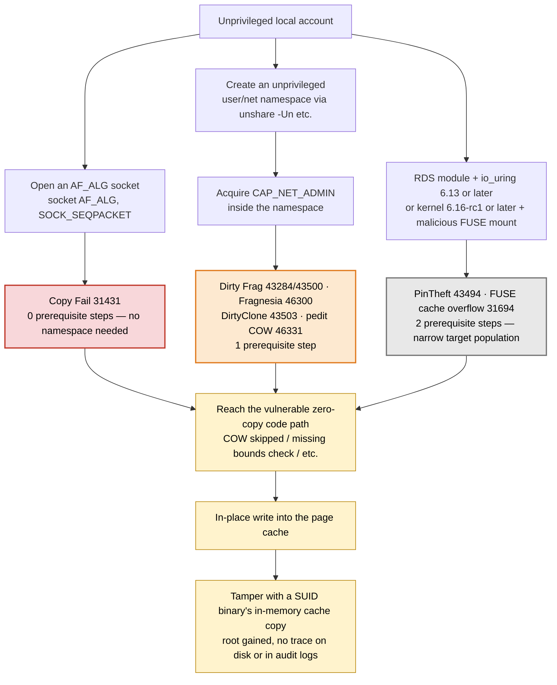

# Linux Kernel Page-Cache LPE Vulnerability Guide (Copy Fail · Dirty Frag family and beyond)

**Target CVEs**: CVE-2026-31431 (Copy Fail), CVE-2026-43284/CVE-2026-43500 (Dirty Frag), CVE-2026-46300 (Fragnesia), CVE-2026-43503 (DirtyClone), CVE-2026-46331 (pedit COW), CVE-2026-43494 (PinTheft), CVE-2026-31694 (FUSE directory-cache overflow) — 8 CVEs total

**Purpose**: explain the technical root cause and shared traits of these 8 vulnerabilities that misuse the page cache as an in-place write target, document how to apply the official patches and what to watch for, and provide a safe procedure for using the [mitigate-cve-2026.sh](mitigate-cve-2026.sh) mitigation script on production systems that cannot patch immediately. **The script automates 6 of the 8** (31431/43284/43500/46300/43503/46331) — the other 2 (PinTheft, FUSE) have manual-only mitigation steps in section 5.6.

**Audience**: system/security operators, and whoever will apply this script to production servers.

[🇰🇷 한국어 버전](pagecache-lpe-guide.ko.md)

---

## TL;DR

- **Same flaw, different paths — now 8 of them.** All share the same failure class: "treating file-backed page-cache memory as a normal write target and writing to it in place." But the specific technical defect splits into at least 4 families: ① loss of the `SKBFL_SHARED_FRAG` flag (43284/43500/46300/43503), ② the reverted 2017 AEAD in-place optimization (31431), ③ a COW-range miscalculation in `skb_ensure_writable()` (46331), and ④ unrelated one-off bugs — an RDS double-free (43494) and an unchecked FUSE boundary (31694). Trigger paths differ, so **each of the 8 CVEs exists as a separate patch commit** (section 1, section 3.1).

- **Real-world risk splits into 3 tiers — respond in this order, not by CVE count.**
  - 🔴 **P1**: Copy Fail (31431) — the only one listed in CISA KEV with confirmed active exploitation; its trigger needs no namespace at all.
  - 🟠 **P2**: Dirty Frag (43284/43500), Fragnesia (46300), DirtyClone (43503), pedit COW (46331) — all share the exact same prerequisite (an unprivileged user/net namespace to acquire CAP_NET_ADMIN), all have public PoCs, and all have a vendor RHSB (RHSB-2026-003 for 43284/43500/46300, RHSB-2026-008 for 46331).
  - ⚪ **Other (low likelihood right now)**: PinTheft (43494) — the RDS module isn't compiled into most distro kernels by default. FUSE cache overflow (31694) — requires kernel 6.16-rc1+, so RHEL and other major distros are entirely unaffected as of now. (section 1.1)

- **"We patched" only guarantees safety if all the relevant commits are present.** Fragnesia (46300) in particular is a separate, pre-existing flaw that only becomes exploitable once the 43284 patch is applied — **a kernel with 43284 but not 46300 can be more exposed than one with neither.** DirtyClone (43503) requires the entire "DirtyFrag + Fragnesia chain" for full protection (section 2.4, section 4.1).

- **Comparing `uname -r` version numbers alone cannot tell you if you're patched.** Distros frequently keep the upstream version string while backporting only the security fix. Check the CVE ID directly against your distro's advisories (section 4.2).

- **More RHEL exemptions now, but don't generalize them to "RHEL family."** Beyond 43500 (RxRPC), **both 43494 (PinTheft) and 31694 (FUSE) are officially not affected on RHEL itself (RHEL 6–10).** But that doesn't extend to every RHEL-derived distro — **Oracle Linux (UEK) is directly verified to ship `CONFIG_RDS=m`**, so PinTheft *does* apply there (section 2.7). Conversely, 46331 (pedit COW) does affect RHEL 8/9/10. The rest are mostly affected, and the `el9_7`/`el10_1` minor streams in particular never received fixes for 46300/43503 — **updating packages within the same stream is not enough; you must switch minor streams** (section 4.4).

- **A real patch is the only complete fix; the mitigation script is a stopgap until then.** The module-blocking approach in [mitigate-cve-2026.sh](mitigate-cve-2026.sh) is the exact procedure Red Hat documents in RHSB-2026-003 / RHSB-2026-008. That said, DirtyClone's root cause lives in the kernel core, so blocking modules only closes the confirmed trigger (esp4/esp6) — and **PinTheft and FUSE are not yet automated by the script** (section 5, section 5.6).

---

## Needs re-verification before you apply

- **CISA KEV listing, active-exploitation status, and CVSS scores are point-in-time snapshots.** The table in section 1.1 reflects the time of research; re-check all 8 CVEs against the [CISA KEV catalog](https://www.cisa.gov/known-exploited-vulnerabilities-catalog) at the time you actually apply this.
- **Vendor advisories, RHSA numbers, and package versions are all snapshots re-verified on 2026-07-22.** In particular, verify the RHSA numbers and build versions in section 4.4 directly against the erratum page before rolling out in production.
- **Oracle Linux 9 (UEK) has no published advisory for CVE-2026-43503 as of 2026-07.** Even the latest UEK kernel may still be unpatched for this CVE.
- **CentOS Linux 7/8 (the traditional CentOS, now EOL) will not receive official patches for any of the original 5 CVEs.** Migrating to AlmaLinux/Rocky, or paying for ELS, is effectively the only remaining path (section 4.4).
- **"RHEL family, so not affected" doesn't hold without checking the specific distro.** PinTheft (43494) is not affected on RHEL proper and CloudLinux, but **is affected on Oracle Linux (UEK)** — verified directly on 2026-07-23 (`CONFIG_RDS=m`/`CONFIG_RDS_RDMA=m`/`CONFIG_RDS_TCP=m`). RDS was built by Oracle for RAC database interconnects, so this was a predictable gap that an earlier version of this guide missed by generalizing across "RHEL family" without checking (section 2.7, section 4.4).
- **pedit COW's (46331) CVSS differs by scoring authority in how they judge the privilege requirement (`PR`)** — kernel.org rates it `PR:L` (7.8), Red Hat rates it lower at `PR:H` (6.7). For an operational decision, go by "can CAP_NET_ADMIN be acquired via an unprivileged namespace" rather than the score alone (section 2.7).
- **Secondary sources — and even primary sources — disagree with each other in places.** This document always favored primary sources (OSV, Red Hat Security Data API) — e.g. RxRPC's vulnerable-since version (OSV/NVD's `5.3` vs. some blogs' "since ~2023"), Fragnesia's nature (a pre-existing flaw since 3.9, not a regression caused by the 43284 patch), and the CVSS vectors for CVE-2026-43284/43503/43494 (OSV/kernel.org vs. Red Hat's own vector disagree — see the footnote in section 4.3 and the appendix). If this matters to a decision, re-query the primary source directly.
- **A kernel whose changelog has no CVE ID** cannot be distinguished, from local information alone, between "not yet patched" and "this distro just doesn't record CVE IDs" (section 4.2). Use `--online` or a manual advisory lookup to resolve this.
- **The FUSE bug's (31694) "research disclosure date" is reported inconsistently across sources** — NVD lists it 2026-05-01, but press coverage spread around 2026-07-10. This document uses the NVD date (section 2.8).

---

## 1. Target vulnerabilities at a glance

| CVE | Alias | Subsystem | Related module | CVSS | Research disclosure | NVD published | Script support | Fix commit/version |
|---|---|---|---|---|---|---|---|---|
| CVE-2026-31431 | Copy Fail | Kernel crypto API (AF_ALG) | `algif_aead` | 7.8 | 2026-04-29 | 2026-04-22 | ✅ | `a664bf3d603d` and others (reverts the 2017 optimization `72548b093ee3`) |
| CVE-2026-43284 | Dirty Frag (ESP) | IPsec ESP input processing | `esp4`, `esp6` | 8.8 (Red Hat rating 7.8) | 2026-05-07 | 2026-05-08 | ✅ | `f4c50a4034e6` (introduces `SKBFL_SHARED_FRAG`) |
| CVE-2026-43500 | Dirty Frag (RxRPC) | RxRPC protocol processing | `rxrpc` | 7.8 | 2026-05-07 | 2026-05-11 | ✅ | Separate commit from ESP (different subsystem, independent patch required) |
| CVE-2026-46300 | Fragnesia | ESP path (`skb_try_coalesce()`) | `esp4`, `esp6` | 7.8 | 2026-05-13 | 2026-05-23 | ✅ | Independent patch fixing a path distinct from 43284 |
| CVE-2026-43503 | DirtyClone | skb clone path (kernel core) | Triggered via `esp4`, `esp6` | 8.8 (Red Hat rating 7.0) | 2026-06-25 | 2026-05-23 | ✅ | Mainline merge 2026-05-21, included in upstream v7.1-rc5 (2026-05-24) |
| CVE-2026-46331 | pedit COW | tc (traffic control) `act_pedit` | `act_pedit` | 7.8 (kernel.org) / 6.7 (Red Hat) | 2026-06-16 | 2026-06-16 | ✅ (since v2.8.0) | v7.1-rc7 (introduced by 899ee91156e5, fixed by 2bec122b9fb9 and others) |
| CVE-2026-43494 | PinTheft | RDS zerocopy + io_uring | `rds`, `rds_tcp`, `rds_rdma` | 7.8 (kernel.org) / 7.0 (Red Hat) | 2026-05-21 | 2026-05-21 | ❌ (manual, section 5.6) | 8 stable-branch patches (c6e51512a784 and others) |
| CVE-2026-31694 | (FUSE cache overflow) | FUSE directory-entry caching | `fuse` | 7.8 (kernel.org) | 2026-05-01 (NVD) / 2026-07-10 (press coverage spread) | 2026-05-01 | ❌ (manual, section 5.6) | 474ce83c96a5 and others (only reachable from 6.16-rc1 onward) |

### 1.1 Threat status

**This family is not a theoretical risk.** Look at the table below before setting response priorities — don't treat all 8 CVEs as equal; group them by **how many prerequisite steps the trigger requires**.

| CVE | Trigger prerequisite | Public PoC | CISA KEV | Active exploitation | Mitigation priority |
|---|---|---|---|---|---|
| **CVE-2026-31431 (Copy Fail)** | Local account only (0 steps) | **Yes** (732-byte Python) | **Listed — 2026-05-01** | **CISA: "evidence of active exploitation in the wild"** | **🔴 P1** |
| CVE-2026-43284 / 43500 (Dirty Frag) | Unprivileged namespace → CAP_NET_ADMIN (1 step) | **Yes** (root in a single command) | Not listed | Microsoft reported possible in-the-wild activity | 🟠 P2 |
| CVE-2026-46300 (Fragnesia) | Unprivileged namespace → CAP_NET_ADMIN (1 step) | Yes (PoC published alongside disclosure) | Not listed | None reported | 🟠 P2 |
| CVE-2026-43503 (DirtyClone) | Unprivileged namespace → CAP_NET_ADMIN (1 step) | Exploit details published (JFrog) | Not listed | None reported | 🟠 P2 |
| CVE-2026-46331 (pedit COW) | Unprivileged namespace → CAP_NET_ADMIN (1 step) | **Yes** (packet_edit_meme, 2026-06-17) | Not listed | None reported | 🟠 P2 |
| CVE-2026-43494 (PinTheft) | RDS module active + io_uring 6.13+, etc. (2 narrow steps) | Yes (multiple on GitHub) | Not listed | None reported | ⚪ Other |
| CVE-2026-31694 (FUSE cache overflow) | Kernel 6.16-rc1+, malicious FUSE mount (2 narrow steps) | No confirmed public PoC | Not listed | None reported | ⚪ Other |

`algif_aead` (Copy Fail) is priority #1 for more than just its KEV listing — the 4 P2 items (43284/43500/46300/43503/46331) all require creating at least a user/net namespace, while `AF_ALG` sockets require none of that (section 3.2). **If you can only apply a partial mitigation, block `algif_aead` first** — it's usually rarely used in production, so the blast radius is smallest (whereas blocking esp4/esp6 breaks VPNs).

**The 5 P2 items share essentially the same mitigation lever** — blocking unprivileged user/net namespace creation closes the trigger path for all of them (section 3.2). "Dirty Frag" originally named only 43284/43500, but this guide groups 46300/43503/46331 alongside them in practice, since they share the same prerequisite and the same mitigation lever.

**The two "Other" items are rated low not because they're less severe, but because current real-world exposure is narrow.** PinTheft needs a module (RDS) most distros (RHEL/Ubuntu/Debian) don't compile in by default, and the FUSE bug needs a very recent kernel (6.16-rc1+) that major stable distros — including RHEL — don't ship yet (section 2.6, section 2.8, section 4.4). **If your fleet actually uses RDS, or tracks bleeding-edge mainline kernels, re-rate these higher.**

---

## 2. Individual vulnerability details

### 2.1 Copy Fail (CVE-2026-31431)

- **Disclosure**: 2026-04-29, announced by security firm Theori. The mainline fix commit had already been merged earlier, on 2026-04-01 (patch-first, disclose-later). The kernel security team was notified roughly 5 weeks before disclosure.
- **Discoverer**: Taeyang Lee (Theori).
- **Path**: the `AF_ALG` socket, the userspace interface to the kernel crypto API — specifically the `algif_aead` module.
- **Root cause**: a 2017 performance optimization (commit `72548b093ee3`) switched AEAD operations to run in-place. Under specific conditions, AEAD cipher operations are then performed in place on file-backed pages. The fix reverts this optimization and shipped as 8 commits across stable branches, including `a664bf3d603d` and `fafe0fa2995a`.
- **Trigger condition**: any unprivileged user able to create an AEAD cipher socket via `socket(AF_ALG, SOCK_SEQPACKET, 0)` — reachable regardless of whether IPsec/VPN is configured.
- **Relationship to the other 4**: its root code path differs from the rest. It belongs to the same "page cache treated as packet" failure family but must be classified as a separate vulnerability from the ESP/RxRPC group.

### 2.2 Dirty Frag / ESP (CVE-2026-43284)

- **Disclosure**: 2026-05-07
- **Path**: IPv4/IPv6 IPsec ESP input processing (`esp_input()`), the `esp4`/`esp6` modules.
- **Root cause**: the `SKBFL_SHARED_FRAG` flag, which marks an skb fragment as referencing a shared/file-backed page, is not propagated along a specific fragmentation path, so ESP decryption ends up writing to that page in place.
- **Discoverer**: Hyunwoo Kim.
- **Patch**: mainline commit `f4c50a4034e6` — correctly introduces and propagates the `SKBFL_SHARED_FRAG` flag.

### 2.3 Dirty Frag / RxRPC (CVE-2026-43500)

- **Disclosure**: 2026-05-07 (disclosed together with the ESP issue — Dirty Frag was originally research covering both the ESP and RxRPC paths).
- **Path**: the RxRPC protocol stack (`rxrpc` module, used by the AFS filesystem, among others).
- **Root cause**: the same `SKBFL_SHARED_FRAG` failure pattern as ESP, but occurring independently in RxRPC's own path — **the ESP patch does not fix the RxRPC issue.** Specifically, the DATA-packet handler in `rxrpc_input_call_event()` and the RESPONSE handler in `rxrpc_verify_response()` fail to unshare externally-owned page fragments before decryption.
- **Patch status**: the upstream patch has already been merged and shipped as 5 stable commits, landing in `6.6.140` / `6.12.88` / `6.18.29` / `7.0.6` and v7.1 onward (per OSV). Distro backport timing may vary, so reconfirm against your advisory in production.
- **Red Hat exception**: Red Hat states in RHSB-2026-003 that this CVE does not affect its products (section 4.4).

### 2.4 Fragnesia (CVE-2026-46300)

- **Disclosure**: the discoverer published it with a PoC and kernel patch on 2026-05-13; press coverage followed on 2026-05-14 (less than a week after Dirty Frag's disclosure). NVD listing: 2026-05-23.
- **Path**: the skb fragment-coalescing function `skb_try_coalesce()`. When this function moves a page fragment into another buffer, it fails to preserve the `SKBFL_SHARED_FRAG` marker, so ESP input processing wrongly assumes it's safe to decrypt that buffer in place.
- **Discoverer**: William Bowling.
- **Root cause — not a regression from the 43284 patch**: this is a **pre-existing flaw in `skb_try_coalesce()` dating back to kernel 3.9** (per OSV/NVD's vulnerable-since version), which only became exploitable once the 43284 patch changed ESP input-path behavior. The two are **distinct vulnerabilities requiring separate patches**.
- **Implication**: **only a kernel with the 46300 patch applied is safe on the ESP path.** A system with 43284 alone can be more exposed on this path than an unpatched one, so both patches must be applied together.

### 2.5 DirtyClone (CVE-2026-43503)

- **Disclosure**: patch merged 2026-05-21 (included in v7.1-rc5), NVD listed 2026-05-23, JFrog published exploit details on 2026-06-25 — **not a June discovery; the patch and CVE already existed by late May.**
- **Path**: the core kernel function that performs skb cloning, `__pskb_copy_fclone()`, and the consumer of that clone, `esp_input()` (`esp4.c`). **The confirmed trigger sink is the ESP path, and the published exploit uses it.**
- **rxrpc is not DirtyClone's trigger path**: it's commonly misread because JFrog's mitigation advisory includes `rxrpc`, but that's only a precautionary block for the DirtyFrag family as a whole. So **in an environment where 43500 doesn't apply (e.g. RHEL), leaving rxrpc unblocked does not leave the 43503 path open.**
- **Root cause**: during packet cloning, the `SKBFL_SHARED_FRAG` safety flag is lost, causing a file-backed (page-cache-backed) page to be misjudged as "safe to write." ESP's AES-CBC in-place decryption then runs directly on that page, letting an attacker write arbitrary bytes into the page cache.
- **Impact**: for example, an attacker can leave the on-disk binary of `/usr/bin/su` untouched while **tampering only with the in-memory page-cache copy**, swapping the setuid binary's behavior → this evades file-integrity checks (disk hash comparison) and leaves no trace in audit logs since no separate file-write syscall occurs.
- **Discovered by**: JFrog Security Research. CVSS 8.8.
- **Patch**: included from upstream v7.1-rc5 (2026-05-24) onward. It's explicitly stated that only a kernel with the entire "DirtyFrag + Fragnesia chain" is fully protected — backporting the DirtyClone patch alone may not be safe.

### 2.6 pedit COW (CVE-2026-46331)

- **Disclosure**: 2026-06-16. The next day (06-17), researcher Massimiliano Oldani published a public PoC named `packet_edit_meme`.
- **Path**: the `act_pedit` module — the packet-header-editing action in the traffic control (tc) subsystem.
- **Root cause**: `tcf_pedit_act()` computes the COW (copy-on-write) target range it passes to `skb_ensure_writable()` **only once, as a hint (`tcfp_off_max_hint`), before the header-editing loop starts.** That hint doesn't account for the offset that typed keys add at runtime, so part of the write region ends up un-COW'd. The header edit then lands directly on the shared page cache. **This is a defect in a different COW mechanism (`skb_ensure_writable()`) than the `SKBFL_SHARED_FRAG` family** — its root code differs from 43284/43500/46300/43503 — but the outcome is the same: the page cache gets misjudged as safe to write.
- **Trigger condition**: requires `CAP_NET_ADMIN` — typically acquired via an unprivileged user/net namespace (allowed by default on RHEL/Debian/Ubuntu). **Exactly the same prerequisite** as Dirty Frag/Fragnesia/DirtyClone (section 3.2).
- **Affected versions**: v5.18 through v7.1-rc6 (introduced by commit `899ee91156e5`), fixed in v7.1-rc7.
- **Vendor response**: Red Hat published a dedicated **RHSB-2026-008** (rated Important). Both module blocking (`act_pedit`) and unprivileged-namespace restriction are officially documented as mitigations — the same pattern as RHSB-2026-003.
- **CVSS disagreement**: kernel.org rates it 7.8 (`PR:L`) vs. Red Hat's 6.7 (`PR:H`) — the two disagree on the privilege-requirement level. For an operational decision, go by "can CAP_NET_ADMIN be acquired via an unprivileged namespace" rather than the CVSS number alone.
- **Script support**: [mitigate-cve-2026.sh](mitigate-cve-2026.sh) in this repository automates `act_pedit` — autoload blocking and unload work the same way as esp4/esp6/rxrpc/algif_aead, plus a dedicated tc-pedit usage-signal check (`tc actions show action pedit`) (section 5.1). Verified the diagnosis (`--dry-run --verbose`) path on a real Oracle Linux 9.8 UEK host — that host already had 46331 patched, so the actual block/unload/rollback path wasn't exercised for this specific CVE there; that part relies on the same generic, array-driven logic already verified end-to-end with esp4/esp6.

### 2.7 PinTheft (CVE-2026-43494)

- **Disclosure**: 2026-05-21 (NVD).
- **Path**: the combination of the RDS (Reliable Datagram Sockets) zerocopy path and io_uring fixed buffers (`IORING_REGISTER_CLONE_BUFFERS`, kernel 6.13+). Related modules: `rds`/`rds_tcp`/`rds_rdma`.
- **Root cause**: when `iov_iter_get_pages2()` fails inside `rds_message_zcopy_from_user()`, the pinned pages are released, but the `op_nents` counter isn't reset — so `rds_message_purge()`'s later cleanup loop frees the same page again, a **double-free** (CWE-1341). Chaining this double-free with io_uring fixed buffers lets an attacker reliably overwrite the page-cache copy of a SUID binary.
- **Trigger condition**: needs a kernel with `CONFIG_RDS`/`CONFIG_RDS_TCP` enabled, and the public PoC requires kernel 6.13+ for io_uring's `IORING_REGISTER_CLONE_BUFFERS`.
- **RDS was originally designed by Oracle as the interconnect protocol for RAC (Real Application Clusters) database nodes.** `rds_rdma` handles InfiniBand/RDMA-based cluster communication. Because of this, "the RDS module is compiled in" can itself be a signal that the box is a real production database cluster node — see the RHEL/Oracle Linux note below.
- **RHEL (the actual product) impact**: **officially "Not affected" across RHEL 6–10** (Red Hat Security Data API — `package_state` is Not affected everywhere, no `affected_release` entries). Red Hat's own kernel source configs carry `# CONFIG_RDS is not set` — the module doesn't exist at all, and `socket()` returns `EAFNOSUPPORT` immediately.
- **⚠️ Oracle Linux (UEK) is NOT covered by that "RHEL not affected" finding — verified directly, it ships `CONFIG_RDS=m`.** On 2026-07-23, checking the reference server (Oracle Linux 9.8, kernel `5.15.0-322.203.3.4.el9uek.x86_64`) with `grep CONFIG_RDS /boot/config-$(uname -r)` showed all three of `CONFIG_RDS=m`, `CONFIG_RDS_RDMA=m`, `CONFIG_RDS_TCP=m` compiled in. In hindsight this is unsurprising — Oracle built this protocol for its own RAC product, so of course Oracle Linux keeps it — but an earlier version of this guide generalized this as "RHEL family" without checking that specifically, which was wrong. **Never assume "RHEL family, so not affected" without verifying the specific distro.**
- **Mitigation**: on distros where RDS is actually compiled (Ubuntu, Oracle Linux, etc.), blocking `rds`/`rds_tcp`/`rds_rdma` is documented in the community as a working mitigation (section 5.6). Red Hat's own mitigation field says "no mitigation available / doesn't meet criteria," but this reads as boilerplate stemming from RHEL (the actual product) simply not being affected — don't confuse it with "no mitigation exists anywhere."
- **It's rated "Other" not because the risk is low, but because there's no reliable usage-signal detection method yet.** See section 5.6 for the full reasoning and why the script doesn't automate this one.

### 2.8 FUSE directory-cache overflow (CVE-2026-31694)

- **Disclosure**: NVD listed it 2026-05-01. Press coverage spread around 2026-07-10 — more than two months apart (it's usually referred to only by CVE number, with no popular nickname).
- **Path**: the FUSE (userspace filesystem) directory-entry caching function `fuse_add_dirent_to_cache()`. This is core kernel logic, not a separate protocol module.
- **Root cause**: a malicious FUSE server can return a directory entry whose serialized size is derived from an **attacker-controlled filename-length field**, and the kernel never checks whether that size fits within `PAGE_SIZE` (4096 bytes). A maximum-sized entry can reach 4120 bytes, overflowing **24 bytes** into the adjacent kernel page (NVD-CWE-noinfo — no detailed CWE assigned). Where 43284 through 46331 fail by "skipping COW," this one fails by "having no boundary check at all" — a **different kind of defect**.
- **Trigger condition**: a local user needs to be able to interact with a malicious/controlled FUSE server (typically one they mount themselves), and this code path only exists on **kernel 6.16-rc1 or later**.
- **RHEL impact**: **officially "Not affected" across RHEL 6–10** (`package_state` Not affected everywhere, no `affected_release` entries) — presumably because RHEL kernels don't yet carry the larger-FUSE-readdir-buffer change that makes this reachable.
- **Mitigation (community guidance, not vendor-official)**: restrict unprivileged FUSE mounts, remove the setuid bit from `fusermount3` (only where FUSE isn't needed at all), and review user-namespace policy. The `fuse` module itself is depended on by sshfs, rclone, and many Snap packages, so its usage footprint is wider than esp4/esp6 — **a blanket module block is not recommended.**
- **Why it's rated low**: the required kernel version (6.16-rc1+) is ahead of most stable distros as of this writing, so real exposure is currently limited to rolling-release/bleeding-edge-mainline systems. Re-evaluate upward once your distro's kernel line catches up.

---

## 3. Shared traits: root cause and structure

### 3.1 The shared failure mechanism

For performance, the Linux kernel networking/filesystem stack optimizes to reference pages directly instead of copying data (zero-copy). When that page happens to be **file-backed page cache** (an executable's mapping, data delivered via splice, etc.), writing to it carelessly corrupts the file cache itself. To prevent this, the kernel places safeguards at each code path — flags such as `SKBFL_SHARED_FRAG` marking "this is shared — copy it (copy-on-write) before modifying," or bounds checks limiting how much may be written.

**The 8 CVEs share the same outcome, but not a single technical root cause** — they split into at least 4 families:

| Defect family | Mechanism | CVEs |
|---|---|---|
| Loss of the `SKBFL_SHARED_FRAG` flag | The flag marking an skb fragment as referencing a shared/file-backed page fails to propagate through fragmentation, coalescing, cloning, or reassembly | 43284, 43500, 46300, 43503 |
| Reverted AEAD in-place optimization | A 2017 performance optimization made cipher operations run in place on file-backed pages | 31431 |
| `skb_ensure_writable()` COW-range miscalculation | The COW target range is computed once (incorrectly) before the edit loop, leaving part of the write region un-COW'd | 46331 |
| One-off defects (double-free, missing bounds check) | An uninitialized RDS zerocopy counter causing a double-free; an unchecked FUSE entry size causing an overflow — unrelated bugs that both happen to land writes in the page cache | 43494, 31694 |

In other words, the "shared trait" in this guide isn't a single bug with several variants — it's **the same failure pattern ("treat a file-backed page as unsafe to write") recurring independently across different corners of the kernel** (see the lineage in section 3.3). `SKBFL_SHARED_FRAG` loss is simply the largest sub-family (4 CVEs), not a mechanism that represents all 8.

### 3.2 A common misconception: "we don't use this feature" is not safety

Section 2's "path / trigger condition" describes **which subsystem the vulnerable code lives in**, not "this is only dangerous if the administrator has enabled and is using that feature."

- **Policy-level non-use** (the administrator never configured IPsec/VPN/AF_ALG) means nothing to the kernel. On an unpatched kernel, the vulnerable code is still present on the server.
- **Only technical unreachability** (the code doesn't exist, or its call path is blocked) provides an actual defense.

`algif_aead` (Copy Fail) is completely unrelated to IPsec/VPN configuration — `socket(AF_ALG, SOCK_SEQPACKET, 0)` can be called by any local account with no permission check whatsoever. The `esp4`/`esp6`/`rxrpc`/`act_pedit` (pedit COW) paths normally require `CAP_NET_ADMIN` for legitimate use, but inside an unprivileged user/net namespace (`unshare -Un`, etc.) — which most distros allow by default — an ordinary account can effectively reach that code with administrator-equivalent privilege. In short: **once a low-privileged account is already compromised, an attacker can invoke the feature directly and exploit the vulnerability regardless of the administrator's "we don't use it" policy.** All 5 P2 items (43284/43500/46300/43503/46331) fall under this exact logic, so **a single unprivileged user/net namespace restriction is a lever effective against all 5 at once** — and the script automates all 5 (section 5.1).

This is why blocking modules (`install ... /bin/false`) in [mitigate-cve-2026.sh](mitigate-cve-2026.sh) provides real defense — it's a technical measure that makes the kernel's module-autoload mechanism (`request_module()`) itself fail, **rendering the code path fundamentally unreachable regardless of the caller's privilege level.** By the same logic, this defense doesn't work when the target code is built in (`=y`) — there is no "load step" to block in the first place (section 5.5).

> **This approach matches the vendor's own official guidance.** For systems that cannot patch immediately, Red Hat directly recommends the following mitigation in RHSB-2026-003:
>
> ```
> printf 'install esp4 /bin/false\ninstall esp6 /bin/false\n' > /etc/modprobe.d/dirtyfrag.conf
> rmmod esp4 esp6 2>/dev/null; true
> ```
>
> This repository's script automates and hardens that exact procedure by adding pre-checks, distro patch determination, usage-signal detection, and post-verification. It can be cited as justification when requesting change-management approval (section 5.4). That said, Red Hat also warns that "blocking esp4/esp6 disables IPsec functionality," and offers disabling unprivileged user namespaces as an alternative for systems that need IPsec — that caveat should always be cited alongside the mitigation itself.

RHEL/CentOS being exempt for RxRPC (43500) and someone claiming an exemption because "the administrator doesn't use it" rest on entirely different grounds. The former is a technical fact confirmed at the distro level; the latter is a policy-level illusion with no actual defensive effect.

Red Hat has officially documented the reason as well. Per its security-data statement, RHEL 9/10 kernel source configs include rxrpc, but **Red Hat does not ship or support a binary RPM providing this module.** It is not installed by default and is absent from both the supported kernel packages and RHCOS images. Oracle Linux (UEK) is the same, with `# CONFIG_AF_RXRPC is not set`.

#### Trigger path at a glance

The diagram below summarizes the point made above: the number of prerequisite steps determines priority — fewer steps required of the attacker means a higher priority.



**How to read this**: all three paths converge on the same outcome — "in-place page-cache write → root" — but differ in how many prerequisite steps it takes to get there. Copy Fail needs nothing but opening a socket (0 steps), so it's P1. The 5 P2 items all have to pass through the same single gate — creating a namespace (1 step, exactly the logic in section 3.2). The 2 "Other" items need that same gate plus additional module/kernel-version prerequisites (2 steps). This diagram is also why **a single unprivileged-namespace restriction in this mitigation script is effective against all 5 P2 items at once** — they all have to pass through the same gate.

### 3.3 Lineage: why this class of bug keeps recurring

This family extends a long-running lineage of "page cache in-place write" vulnerabilities in the Linux kernel.

```
Dirty COW (2016, CVE-2016-5195)
   └─ COW race condition allows writes to read-only pages
Dirty Pipe (2022, CVE-2022-0847)
   └─ missing pipe-buffer flag initialization allows direct page-cache overwrite
Dirty Cred
   └─ kernel credential-object reuse flaw
Dirty Frag family (2026, SKBFL_SHARED_FRAG loss)
   └─ Copy Fail (31431, joined the family via a reverted AEAD in-place optimization)
   └─ Dirty Frag/ESP (43284), Dirty Frag/RxRPC (43500)
   └─ Fragnesia (46300, skb_try_coalesce())
   └─ DirtyClone (43503, __pskb_copy_fclone())
   └─ pedit COW (46331, skb_ensure_writable() COW-range miscalculation — different mechanism, same outcome)
Unrelated page-cache defects (2026, no connection to the above)
   └─ PinTheft (43494, RDS zerocopy double-free + io_uring)
   └─ FUSE cache overflow (31694, unchecked directory-entry boundary)
```

Key takeaway: the pattern of "an in-place write happening by mistake where a copy should have occurred" is itself a structurally recurring bug class in Linux's networking/memory subsystems. Rather than expecting one complete fix to end it permanently, assume **further variants are likely to keep surfacing** as related paths are discovered. The fact that PinTheft and the FUSE bug are technically unrelated to the `SKBFL_SHARED_FRAG` family yet were discovered independently around the same time, with the same outcome (in-place page-cache tampering), shows this isn't a single flag's problem — it's **a structural risk recurring across every zero-copy optimization point in the kernel.**

The structural problem worth noting is that **the places in the kernel that must preserve the `SKBFL_SHARED_FRAG` flag are scattered widely**: fragmentation (43284), coalescing via `skb_try_coalesce()` (46300), cloning via `__pskb_copy_fclone()` (43503), and per-protocol reassembly (43500) — fixing one leaves the others exposed. Fragnesia only becoming exploitable after the 43284 patch (section 2.4) also shows that fixing one path can **expose or activate** a latent flaw in another.

### 3.4 Why this is especially dangerous

- **The privilege escalation itself is local** — no remote code execution is needed. A process that already has low privileges (a container escape, a webshell, a compromised service account) can jump straight to root.
- Many variants **leave the on-disk file untouched and tamper only with the in-memory (page cache) copy**, evading file-integrity monitoring (AIDE, Tripwire, etc.) and disk-hash comparisons.
- Some paths involve no separate file-write syscall, so **standard audit logging (auditd, etc.) may show no trace at all.**

---

## 4. Applying the official patch, and what to watch for

### 4.1 Understand the "chain" concept — this is not a single patch

The original 5 CVEs are 5 distinct commits. For "we updated the kernel" to actually guarantee safety, the running version must include all 5.

- Copy Fail has a different root code path from the rest and **must always be verified independently.**
- Dirty Frag (ESP) and Dirty Frag (RxRPC) share a name but are **separate commits.**
- Fragnesia is a flaw on a separate path that only becomes exploitable once the 43284 patch is applied, so a kernel with 43284 but not 46300 remains vulnerable (section 2.4).
- DirtyClone's precondition for full protection is the entire "DirtyFrag + Fragnesia chain."

**The 3 additionally identified CVEs (pedit COW/PinTheft/FUSE) are not part of this 5-commit chain.** Patching all 5 above does not resolve these 3, and patching these 3 does not complete the original chain either — verify each CVE ID independently. Note that pedit COW and PinTheft also show a Fragnesia-like split between "vulnerable since" and "actually exploitable since" (section 2.6, section 2.7, section 4.3).

### 4.2 Don't judge patch status by version comparison alone

Comparing the `uname -r` version string against the upstream fix version is **not reliable on distro kernels.** Ubuntu/RHEL/Debian and others frequently keep the upstream version number while backporting the security fix separately.

**Recommended verification procedure**:
1. Search each of the 8 CVE IDs against your distro's security advisories (Ubuntu USN, RHEL RHSA, Debian DSA, SUSE-SU, etc.).
2. Check the package's change history:
   - Debian/Ubuntu: `apt changelog linux-image-$(uname -r)`, then grep for the CVE ID
   - RHEL/CentOS/Fedora: `rpm -q --changelog kernel-$(uname -r)`, then grep for the CVE ID
   - SUSE: cross-check the corresponding SUSE-SU advisory
3. Only conclude "fully patched" once **all 5** of the original CVE IDs are confirmed. pedit COW/PinTheft/FUSE are a separate chain — verify each individually.
4. Use automated tooling where available: Ubuntu's `ubuntu-security-status` / `pro fix CVE-XXXX --dry-run`, RHEL's `oscap`, etc.

**[mitigate-cve-2026.sh](mitigate-cve-2026.sh) automates steps 2–3 above — but only for 6 CVEs (the original 5 plus pedit COW).** It checks `rpm -q --changelog` on Red Hat family and dpkg changelogs on Debian/Ubuntu family (section 5.1). PinTheft/FUSE aren't checked by the script yet, so apply the procedure above manually (section 5.6).

#### When the changelog has no CVE ID

In this case, every local determination becomes `[unknown]`. There are two possible causes, and local information alone cannot distinguish them:

- **Not yet patched** — the most common case. If the kernel was built before the CVE was disclosed, it simply can't be in the changelog.
- **Not recorded at all** — some community/SBC distros generate a single auto-generated changelog line (`Initial changelog entry for ...`) with nowhere to record it.

So don't jump from "no CVE ID" to "this distro just doesn't record CVEs." Most major distros record them precisely — even Oracle UEK, alongside its Orabug numbers.

```
- crypto: algif_aead - Revert to operating out-of-place (Herbert Xu)
    [Orabug: 39250686,39283867,39291961] {CVE-2026-31431}
```

The script deliberately leaves this state as `[unknown]` rather than "unpatched," and keeps it in scope for action — an intentional fail-safe (if it can't be proven, treat it as in scope). `--online` is what disambiguates the two causes.

#### The fix: `--online` — querying vendor advisories

`dnf updateinfo` confirms as vulnerable any CVE whose "fix has shipped but is not installed on this system." The key point is that **neither this document nor the script does the version comparison itself** — only the vendor knows which build is the fix, and the package manager does the comparison against what's installed. A hardcoded table would inevitably be wrong for a bespoke versioning scheme like UEK's.

The determination is **deliberately asymmetric**: an advisory's **presence** confirms vulnerable (strong evidence); its **absence** yields no determination at all. Since an absent advisory can't be distinguished from missing metadata, a misconfigured repo, or genuine non-applicability, reading it as "patched" would be fail-open.

Because it uses the network, the default is offline; `--online` must be given explicitly.

> ⚠️ **Three things to watch for on Oracle Linux UEK**
> - **You cannot use the version table in section 4.3.** UEK doesn't follow upstream point releases; it pins `5.15.0` and appends its own build number (`5.15.0-322.203.3.4.el9uek`). Comparing this against `5.15.208` always reads as "vulnerable," but that's not a valid basis for the judgment.
> - **The kernel package name differs.** It's `kernel-uek-core`, not `kernel-core`/`kernel`.
> - **Don't confuse ELSA advisories.** The ELSA shown by `dnf updateinfo list --cve` sometimes reflects RHCK (`kernel-5.14.0-…el9_7`) rather than UEK, and doesn't apply as-is to a UEK box. Confirm whether you're running UEK or RHCK first.

> ℹ️ **On a kernel whose changelog carries no record at all**, this determination is structurally impossible, so the upstream version table in section 4.3 is a more reliable signal — but only valid if the vendor tracked upstream stable releases as-is, so cross-check against release notes.

### 4.3 Upstream affected version ranges (per OSV/NVD, re-verified 2026-07-22)

Separately from searching by CVE ID, if you want to know exactly which version range is affected, refer to the table below. **Caution**: this is based on the upstream (vanilla) kernel; distro kernels backport differently and these numbers don't apply as-is (section 4.2) — this is purely to get a sense of how broad the exposure window is.

| CVE | Vulnerable since | Fix point per branch (vulnerable if **below** this version) |
|---|---|---|
| CVE-2026-31431 (Copy Fail) | 4.14 | 5.10.254 / 5.15.204 / 6.1.170 / 6.6.137 / 6.12.85 / 6.18.22 / 6.19.12 |
| CVE-2026-43284 (Dirty Frag/ESP) | 4.11 | 5.10.255 / 5.15.205 / 6.1.171 / 6.6.138 / 6.12.87 / 6.18.28 / 7.0.5 |
| CVE-2026-43500 (Dirty Frag/RxRPC) | 5.3 | 6.6.140 / 6.12.88 / 6.18.29 / 7.0.6 |
| CVE-2026-46300 (Fragnesia) | 3.9 | 5.10.257 / 5.15.208 / 6.1.174 / 6.6.141 / 6.12.91 / 6.18.33 / 7.0.10 (7.1-rc1–rc4 also vulnerable) |
| CVE-2026-43503 (DirtyClone) | 3.9 | 5.10.257 / 5.15.208 / 6.1.174 / 6.6.141 / 6.12.91 / 6.18.33 / 7.0.10 (7.1-rc1–rc4 also vulnerable) |
| CVE-2026-46331 (pedit COW) | 5.18 | v7.1-rc7 (branch-by-branch point releases not yet compiled here — check your distro's advisory individually) |
| CVE-2026-43494 (PinTheft) | 4.17 (code defect present since) | 5.10.257 / 5.15.208 / 6.1.174 / 6.6.140 / 6.12.90 / 6.18.32 / 7.0.9 — **but the public exploit needs io_uring's `IORING_REGISTER_CLONE_BUFFERS`, so real exploitability only starts at kernel 6.13** (a Fragnesia-like split between "vulnerable since" and "exploitable since," section 2.7) |
| CVE-2026-31694 (FUSE cache overflow) | 4.20 (code defect present since) | 5.10.258 / 5.15.209 / 6.1.175 / 6.6.136 / 6.18.25 / 7.0.2 — **but real reachability via large readdir buffers only starts at kernel 6.16-rc1** (same pattern, section 2.8) |

**How to read this**: each branch is backported to its own separate point release (e.g. "below 6.1.171" only applies within the 6.1 line), so check the point-release number on your own branch, not just the major version. Taken together, the combined theoretical exposure window across the original 5 CVEs spans kernel **3.9 to 7.1-rc4**, with Fragnesia/DirtyClone reaching back to the oldest kernels.

> The fact that 46300 and 43503 share the same point release per branch is not a typo — the two landed together in the same stable release cycle.

> **Don't conflate "vulnerable since" with "actually exploitable since."** PinTheft and the FUSE cache overflow have old underlying defects (since 4.17 and 4.20 respectively), but actually weaponizing them requires a **later, unrelated kernel feature** — io_uring fixed buffers (6.13+) and large FUSE readdir buffers (6.16-rc1+) respectively. This is the same structure as Fragnesia becoming exploitable only after the 43284 patch (section 2.4) — don't assume "it's an old kernel, so it's safe."

### 4.4 RHEL/CentOS family details

**A distro-structure caveat**: the response differs entirely depending on what "CentOS" refers to.
- **CentOS Stream 9/10**: the upstream rolling distro for RHEL 9/10 — patched effectively identically to RHEL.
- **CentOS Linux 7/8 (the traditional CentOS)**: already EOL (ended 2024-06 and 2021-12 respectively), so none of the 5 CVEs will receive an official patch. Migrating to AlmaLinux/Rocky, or paid ELS (Extended Lifecycle Support) from vendors like TuxCare/CloudLinux, is effectively the only remaining patch path.
- **AlmaLinux / Rocky Linux**: RHEL binary-compatible rebuilds — patches ship almost simultaneously with RHEL.

**Per-CVE RHEL impact**:

| CVE | RHEL 7 | RHEL 8 | RHEL 9 | RHEL 10 |
|---|---|---|---|---|
| 31431 (Copy Fail) | **Not affected** | Affected | Affected → `kernel-5.14.0-611.54.1.el9_7` (RHSA-2026:13565, initial build) | Affected |
| 43284 (Dirty Frag/ESP) | **Not affected** | Affected | Affected | Affected → `kernel-6.12.0-211.16.1.el10_2` (RHSA-2026:19569) |
| 43500 (Dirty Frag/RxRPC) | **Not affected** | **Not affected** | **Not affected** | **Not affected** — RHSB-2026-003 explicitly states "does not affect Red Hat products" |
| 46300 (Fragnesia) | **Not affected** | Affected | Affected | Affected |
| 43503 (DirtyClone) | **Not affected** | **Affected** → RHSA-2026:19666 (kernel) / 19664 (kernel-rt) | Affected (CVSS 7.0) | Affected |
| 46331 (pedit COW) | **Not affected** | Affected → `kernel-4.18.0-553.143.1.el8_10` (RHSA-2026:27353) | Affected (RHSB-2026-008) | Affected → `kernel-6.12.0-211.26.1.el10_2` (RHSA-2026:27288) |
| 43494 (PinTheft) | **Not affected** | **Not affected** | **Not affected** | **Not affected** — `package_state` Not affected across all products, no `affected_release` entries. CONFIG_RDS itself is absent from RHEL kernels (section 2.7) |
| 31694 (FUSE cache overflow) | **Not affected** | **Not affected** | **Not affected** | **Not affected** — `package_state` Not affected everywhere. Presumably because the large-FUSE-readdir-buffer change isn't present (section 2.8) |

> ⚠️ **This table applies to RHEL (Red Hat Enterprise Linux) the actual product only — don't assume "not affected" carries over to RHEL-derived distros** like Oracle Linux, even though CentOS Stream is patched effectively identically to RHEL. In fact, PinTheft (43494) **is not "not affected" on Oracle Linux (UEK)** — checking the reference server (Oracle Linux 9.8, kernel `5.15.0-322.203.3.4.el9uek.x86_64`) directly on 2026-07-23 showed all three of `CONFIG_RDS=m`, `CONFIG_RDS_RDMA=m`, `CONFIG_RDS_TCP=m` compiled in (section 2.7). Always verify "not affected" against the specific distro you're actually running.

> **Don't compare version numbers across rows.** The `kernel-6.12.0-211.16.1.el10_2` (10.2 stream) in the table above and `kernel-6.12.0-124.56.1.el10_1` (10.1 stream) below are on **different minor streams**, so comparing the numeric size directly is invalid (`124` < `211` does not mean el10_1 is the lower version). RHEL maintains an independent kernel line per minor release, so only compare versions **within the same stream** you're actually on (`el9_7`, `el10_1`, `el10_2`, etc.).
>
> Verify the RHSA numbers and package versions in this table directly on the corresponding erratum page before rolling out to production.

> ⚠️ **The `el9_7` and `el10_1` streams never received fixes for 46300/43503** (reconfirmed against Red Hat security data). Both streams stopped after 31431/43284 — `el9_7`'s last build is `kernel-5.14.0-611.55.1.el9_7` (RHSA-2026:16206, covers up to 43284), and `el10_1`'s last build is `kernel-6.12.0-124.56.1.el10_1` (RHSA-2026:16062, covers up to 43284). **Simply updating packages will not resolve 46300/43503 — you must switch minor streams**:
>
> | Target | Stream | Build covering all 4 CVEs (31431/43284/46300/43503) | Basis |
> |---|---|---|---|
> | RHEL 8 | `el8_10` (single stream) | `kernel-4.18.0-553.125.1.el8_10` | RHSA-2026:19666 (kernel-rt: RHSA-2026:19664) |
> | RHEL 9 | `el9_8` | `kernel-5.14.0-687.10.1.el9_8` | RHSA-2026:19568 |
> | RHEL 10 | `el10_2` | `kernel-6.12.0-211.16.1.el10_2` | RHSA-2026:19569 |
>
> Switching streams isn't finished with just `dnf update` — it may require changing your EUS subscription via `subscription-manager`. Treat it as a minor-release upgrade and plan change management accordingly.

#### Primary source: Red Hat Security Data API

This is the basis for the table above. It provides per-CVE, per-product status in machine-readable form, and **should be trusted over blogs and press coverage.**

```
https://access.redhat.com/hydra/rest/securitydata/cve/CVE-2026-43503.json
```

Check both the `package_state` (unfixed status) and `affected_release` (fix shipped) fields together — **if a CVE appears in neither, that means "no information," not "not affected."**

The only "not affected" exemption [mitigate-cve-2026.sh](mitigate-cve-2026.sh) hardcodes is CVE-2026-43500, on the following basis:

- `package_state`: `Not affected` across RHEL 6/7/8/9/10 and OpenShift
- `affected_release`: no entries
- Red Hat's statement: *RHEL 9/10 kernel source configs include rxrpc, but Red Hat does not ship or support a binary RPM providing this module.*

> ⚠️ **Only use primary sources to justify skipping a mitigation.** Secondary sources circulate inaccurate claims, such as "43503 doesn't affect RHEL 8" (in reality it's Affected, with fixes shipped via RHSA-2026:19664 and others). Skipping action based on such claims leaves affected systems exposed.

### 4.5 Reboot vs. live patching

- **Standard kernel update**: requires installing the new kernel and rebooting. The most certain path, but needs downtime or a maintenance window.
- **Live patching (kpatch / Ubuntu Livepatch / kGraft)**: if your distro offers a live patch for the CVE, it can be applied instantly without a reboot. This family saw vendors such as KernelCare ship live patches for EL-family distros within 24 hours of disclosure — worth checking whether your distro/subscription offers this option first.
- Live patching is only ever a bridge until the official kernel update — schedule the actual transition to the patched kernel at your next regular reboot/maintenance window separately.

### 4.6 Things to watch for when verifying after patching

- Because the patches span multiple subsystems (ESP, RxRPC, AF_ALG, skb core), if you run real IPsec tunnels, AFS mounts, or AF_ALG-based applications (e.g. some `cryptsetup`/OpenSSL-engine configurations), verify for functional regressions in staging before rolling the patched kernel to production. The Fragnesia case shows this family's patches shipped under unusual time pressure and had an unusually high subsequent-regression rate.
- Rerunning [this script](mitigate-cve-2026.sh)'s pre-check step (module load status) after patching and logging the result helps with change tracking.

---

## 5. Production environments that can't patch immediately — using the mitigation script

Production fleets often need time for change approval and a maintenance window before a reboot or kernel swap. [mitigate-cve-2026.sh](mitigate-cve-2026.sh) can bridge that gap as a temporary **compensating control**. **Recognize clearly that this does not replace the patch — it only reduces attack surface until the patch can be applied.**

> **Scope note**: this section (5.1–5.5) covers the **6 CVEs** (31431/43284/43500/46300/43503/46331) the script actually automates. The 2 additionally identified CVEs — PinTheft (43494) and the FUSE cache overflow (31694) — are not yet handled by the script; manual mitigation steps for those are in section 5.6.

### 5.1 What the script covers

| Action | Addresses CVE | Method |
|---|---|---|
| Block autoload of `esp4`/`esp6` + unload | 43284, 46300, 43503 | `install .../bin/false` + `blacklist` + `modprobe -r` |
| Block autoload of `rxrpc` + unload | 43500 | Same method |
| Block autoload of `algif_aead` + unload | 31431 | Same method. **This is the top-priority KEV-listed item, so if it's in scope, the script asks about it independently and first**, separate from the rest (section 5.3) |
| Block autoload of `act_pedit` + unload | 46331 | Same method. Also checks tc-pedit usage signals (`tc actions show action pedit`) |
| Built-in (`=y`) detection and warning | All 6 (used to judge trigger reachability) | Checks `/boot/config-$(uname -r)` |
| **Automatic distro patch check + skip already-patched modules** | All 6 | Red Hat family: `rpm -q --changelog` / Debian·Ubuntu family: dpkg changelog. All offline (default). See sections 4.3/4.4 |
| **Vendor security advisory lookup (`--online`)** | All 6 | Red Hat family: `dnf updateinfo` confirms as vulnerable any CVE whose "fix shipped but is not installed" — the only definitive method on a kernel whose changelog has no CVE ID (e.g. Oracle UEK). Debian family: falls back to `apt changelog`. See section 4.2 |
| **VPN/IPsec, RxRPC/AFS, tc pedit, container usage-signal detection (informational)** | Decision support | Checks `ip xfrm state/policy`, IKE ports, strongswan/libreswan services, AFS mounts, `tc actions show action pedit`, docker/podman/containerd/kubelet, etc. (all heuristic — never decides whether to block on your behalf) |
| Restrict unprivileged user/net namespaces (optional) | 43284 / 46300 / 43503 / 46331 (ESP / act_pedit paths). **No effect on 31431** | `kernel.unprivileged_userns_clone=0` / `user.max_user_namespaces=0`. Original values are recorded in the config file's comments before applying |
| **Conclusion-first summary output** | — | By default, prints only the diagnosis (confirmed vulnerable / unknown / not affected) and priority-ordered actions. Rationale is behind `--verbose` |
| **Rollback** | — | `--rollback` deletes the modprobe/sysctl configuration this script created and restores original sysctl values |

> ⚠️ **Namespace restriction does not block `algif_aead` (CVE-2026-31431).** This action blocks "an unprivileged user creating a net namespace to reach ESP/RxRPC code" — but `AF_ALG` sockets can be opened by any local account with no namespace at all (section 3.2). On a system where `algif_aead` is the only built-in target, applying this action would only break containers/sandboxes while doing nothing to stop the KEV-listed CVE. The script detects this case, declines to suggest the action, and notes that a patch is effectively the only remaining option.

### 5.1-1 Command-line interface

```bash
sudo bash mitigate-cve-2026.sh --dry-run            # inspect only, no changes (diagnosis + action summary)
sudo bash mitigate-cve-2026.sh --dry-run --verbose  # + full rationale
sudo bash mitigate-cve-2026.sh --dry-run --online   # + vendor advisory lookup
sudo bash mitigate-cve-2026.sh                      # interactive apply
sudo bash mitigate-cve-2026.sh --yes                # non-interactive apply (Ansible/CI)
sudo bash mitigate-cve-2026.sh --rollback           # revert
```

> **The network is not used by default.** Vendor advisories (`dnf updateinfo`) and the `apt changelog` fallback only run when `--online` is given. This is by design, so a script running on a production server never talks to the outside world without being asked — in air-gapped environments, the defaults work as-is.

**Exit codes**: `0` no action needed / `1` error / `2` invalid argument / `10` action needed (dry-run, or user declined) / `20` changes applied.

For asset scanning, run `--dry-run` and collect only hosts with exit code `10`. In Ansible, pair `--yes` with `failed_when: rc not in [0, 20]`.

> **Root is required**: the script refuses to run as non-root, because privilege-gated detections such as `ip xfrm` fail silently, risking misreading an IPsec-using server as "unused." For the same reason, items where detection failed are shown separately as `[unknown]`, not folded into "no signal."

### 5.2 Prerequisites to confirm before running

- **Reconfirm with the network team that IPsec/VPN is genuinely not in use.** If it is, blocking `esp4`/`esp6`/`rxrpc` causes an outage. The script auto-checks `ip xfrm`/IKE ports/strongswan and shows the signals, but this is a heuristic only — don't treat "no signal" as definitive proof of non-use; confirm with the responsible team in parallel.
- **Confirm no application depends on AF_ALG** (this can include some high-performance `dm-crypt`/`cryptsetup` configurations, OpenSSL AF_ALG engine setups, etc.). AF_ALG is per-socket and hard for the script to detect continuously, so check the `algif_aead` REFCNT in the step-0 table directly (non-zero means currently in use).
- **Confirm container/sandbox dependencies**: applying step 4 (namespace restriction) breaks features that depend on unprivileged user namespaces, such as rootless Docker/Podman, `unshare(1)`, and Chromium/Firefox sandboxes. The script auto-shows whether docker/podman/containerd/kubelet are installed/running, but make the final call after confirming whether the box actually uses a container runtime.
- The script requires root. An interactive terminal is only needed for the default run — `--dry-run`/`--yes` work in non-interactive environments too.

### 5.3 Step-by-step procedure

1. **Run `--dry-run --verbose` for inspection only, first.** This mode has no prompt at all and changes nothing. Since this is the initial detailed inspection, use `--verbose` to see the full rationale — without it, you only get the ~20-line conclusion (diagnosis + action) summary, not the step-by-step detail below.
   ```bash
   sudo bash mitigate-cve-2026.sh --dry-run --verbose | tee "/var/log/mitigate-cve-2026-precheck-$(date +%F-%H%M).log"
   ```
   Internal processing order (printed verbatim with `--verbose`):
   - Step 0: module load status (`USED_BY`, REFCNT)
   - Step 0-1: built-in (`=y`) status. Modules not compiled into the kernel at all are excluded from action here.
   - **Step 0-2**: on Red Hat/Debian families, automatically checks per-CVE distro patch status and excludes modules already confirmed patched (or not affected). If all are resolved, the script logs "no further action needed" and exits early with code `0`.
   - **Step 0-3**: VPN/IPsec, RxRPC/AFS, container usage signals (heuristic). Items where detection failed are shown separately as `[unknown]` — don't read this as "unused."
   - Step 0-4: summary of the planned action (targets to block, exclusions, files to be created). If any existing block would be lifted for a given module, it's flagged separately.
2. Exit code `10` means action is needed. Share the impact assessment with stakeholders before deciding whether to proceed.
3. **Apply for real, logging output for change tracking**:
   ```bash
   sudo bash mitigate-cve-2026.sh | tee "/var/log/mitigate-cve-2026-$(date +%F-%H%M).log"
   ```
4. If `algif_aead` (Copy Fail) is in scope, the script asks about it **independently and first** (explaining both its urgency as the KEV-listed top-priority item and that its risk is low since it's rarely used in practice). It then asks about the remaining in-scope modules as a group. Approving only one still applies whatever was approved — hesitating over another module never sinks the Copy Fail action along with it. Whatever gets approved is used to create the block config (`/etc/modprobe.d/mitigate-cve-2026.conf`), unload currently loaded modules, and run post-verification automatically. The config file's comments record the creation time, hostname, kernel version, and script version for change tracking.
5. If a built-in target was detected, the script separately asks at the end whether to also restrict namespaces — a fresh warning is shown here if container signals were detected. Because of its high impact, **this is never auto-applied even in `--yes` mode**; approve it interactively per host if needed.
6. The script is idempotent, so state persists across reruns. Use `--yes` for bulk rollout.
   ```yaml
   - name: Apply Dirty Frag family mitigation
     ansible.builtin.command: bash /opt/mitigate-cve-2026.sh --yes
     register: mitigate
     changed_when: mitigate.rc == 20
     failed_when: mitigate.rc not in [0, 20]
   ```

### 5.4 Operational recommendations

- **Register a change request**: since this unloads kernel modules, go through a formal change-management (RFC) process. The script itself doesn't require a reboot, but it does alter networking-related kernel behavior.
- **Roll out in stages**: apply to 1–2 canary servers first and monitor, rather than a blanket rollout across the whole fleet.
- **Pair with monitoring**: this mitigation only blocks known trigger paths — the root flaw (especially DirtyClone's `__pskb_copy_fclone()`) remains in the kernel core. Monitoring for anomalies (e.g. unexpected setuid-binary behavior changes, unexpected privilege-escalation attempts) is outside this script's scope and must be configured separately.
- **Tie it to a patch schedule**: regardless of when the mitigation is applied, set and track a target date for the real patch. The mitigation is not an indefinite substitute.
- **Rollback**: use `--rollback` if IPsec/VPN later comes into real use, or if you need to revert.
  ```bash
  sudo bash mitigate-cve-2026.sh --rollback
  sudo modprobe esp4 esp6     # reload modules if needed (the rollback output tells you to)
  ```
  `--rollback` deletes `/etc/modprobe.d/mitigate-cve-2026.conf` and `/etc/sysctl.d/99-mitigate-cve-2026-userns.conf`, and restores the namespace sysctls to their pre-apply values (recorded in the config file's `# mitigate-cve-2026:original ...` comment at apply time). Module reload is deliberately left manual, considering service impact.
- **Watch for unblocking on rerun**: rerunning the script after the kernel is patched removes that module from scope, which lifts the existing block. The script warns about this in advance, but if you want to keep the block even after patching, manage the config file manually.

### 5.5 What this mitigation does not solve

- **DirtyClone's root cause** (`__pskb_copy_fclone()`) is a core kernel function and can't be removed by blocking a module — the script only blocks the confirmed trigger sink (`esp4`/`esp6`). JFrog's research explicitly calls this kind of workaround a stopgap and states that **full protection requires all 4 patches — 43284, 43500, 46300, and 43503 — applied together.**
- Servers that must run IPsec/AF_ALG in production cannot use this mitigation — in that case, a real patch (kernel update or live patch) is the only option.
- This mitigation provides no post-incident detection or forensic capability.
- **Both the automatic distro patch check (step 0-2) and the VPN/container signal detection (step 0-3) are entirely heuristic.** They can miss cases where a fix was backported without recording the CVE ID in the changelog, or where IPsec is configured through means the script doesn't check (xfrm state, specific services, IKE ports). This is exactly why both features are designed to provide information rather than decide on your behalf — the final call always belongs to the operator.
- **`--yes` does not replace human impact assessment.** This flag exists to "reapply an already-reviewed decision consistently across a server group," not to greenlight blanket application to unreviewed infrastructure. Collect the target list with `--dry-run` first, confirm IPsec/AF_ALG usage, and only then use `--yes`.
- **Blocking cannot immediately disable a module that's already loaded and in use.** If `modprobe -r` fails (refcount > 0), that module stays in memory until reboot. The script explicitly warns about this, but if immediate mitigation is required, stop the service using that feature first.

### 5.6 The 2 CVEs the script doesn't cover — manual mitigation

PinTheft (43494) and the FUSE cache overflow (31694) are not yet automated by [mitigate-cve-2026.sh](mitigate-cve-2026.sh). Below are vendor- and community-documented manual procedures. **Confirm actual usage before applying anything, following the same principle as section 5.2** — there is no automatic pre-check, usage-signal detection, or rollback safety net here, so proceed more cautiously than with sections 5.1–5.5.

**The exclusion reason differs for each.**

- **PinTheft (43494)**: excluded because **automated blocking carries an asymmetric risk.** RDS was designed for Oracle RAC database cluster interconnects, so a server with `rds`/`rds_rdma`/`rds_tcp` compiled in could plausibly be a live database cluster node (section 2.7). Reliable usage-signal detection — checking active RDS sockets, Oracle Clusterware processes/package traces, etc. — comparable to what esp4/esp6 (`ip xfrm`), rxrpc (AFS mounts), and act_pedit (`tc actions show`) already have, hasn't been designed or validated yet. Automating a block without that would risk a worse silent failure (severing a live database cluster interconnect) than any of the 6 CVEs the script already automates.
- **FUSE cache overflow (31694)**: excluded for the opposite reason — **its real-world usage footprint doesn't fit the script's "safe to block by default" assumption.** The `fuse` module is depended on by sshfs, rclone, many Snap packages, and desktop cloud-sync tools, unlike the narrowly-used esp4/esp6/rxrpc/act_pedit/algif_aead (section 2.8). It also only manifests on kernel 6.16-rc1+, which RHEL and other major stable distros don't yet ship, lowering the urgency to automate right now. The recommended mitigations (removing `fusermount3`'s setuid bit, mount policy restrictions) don't fit the script's "block one module" pattern either, so they're left as a manual procedure.

#### PinTheft (CVE-2026-43494)

**RHEL (the actual product) and CloudLinux are already not affected** (CONFIG_RDS is absent entirely, section 2.7) — **but Oracle Linux (UEK) is not** (verified `CONFIG_RDS=m`, section 2.7). This procedure applies to distros where RDS is actually compiled in (Ubuntu, Oracle Linux, etc.), and **you must confirm actual RDS usage first** (active sockets, Oracle Clusterware/database clustering software traces, etc.) — this is exactly why it isn't automated yet (see the reasoning at the top of section 5.6).

```bash
printf 'install rds /bin/false\ninstall rds_tcp /bin/false\ninstall rds_rdma /bin/false\n' > /etc/modprobe.d/pintheft.conf
rmmod rds_tcp 2>/dev/null; rmmod rds_rdma 2>/dev/null; rmmod rds 2>/dev/null
true
```

To revert: `rm /etc/modprobe.d/pintheft.conf`, then `modprobe rds` if needed. If your systems run kernel 6.13+ with io_uring in active use, consider re-rating this higher (see the "Other" re-evaluation criteria in section 1.1).

#### FUSE cache overflow (CVE-2026-31694)

The `fuse` module is depended on by sshfs, rclone, and many Snap packages, so its blast radius is wider than esp4/esp6 — **a blanket module block is not recommended.** Instead:

- On systems that never use FUSE at all, remove the setuid bit from `fusermount3`: `chmod u-s /usr/bin/fusermount3` (this disables FUSE entirely for unprivileged users, so confirm actual usage first)
- Restrict unprivileged FUSE mounts by policy (review `user_allow_other` in `/etc/fuse.conf`; pair with unprivileged user/net namespace restriction)
- Fundamentally, this CVE only manifests on kernel 6.16-rc1 and later, so systems not yet on that kernel line are not currently exposed (section 2.8) — if you plan to move to kernel 6.16+, check whether the fix is included at that point.

---

## 6. Checklist

- [ ] **Did you prioritize CVE-2026-31431 (Copy Fail) above everything else?** — it's CISA KEV-listed, has confirmed active exploitation, has a public PoC, and AF_ALG is reachable by any local account without a namespace (section 1.1)
- [ ] Did you re-query the [CISA KEV catalog](https://www.cisa.gov/known-exploited-vulnerabilities-catalog) for all 8 CVEs at the time of application? (the table in section 1.1 is a point-in-time snapshot)
- [ ] Did you individually confirm, via distro advisories (not version comparison), whether the target servers are actually patched for each of the 6 script-supported CVEs (31431/43284/43500/46300/43503/46331)? (sections 4.2–4.4)
- [ ] Did you separately confirm Fragnesia (46300) is included? (43284 alone is insufficient)
- [ ] On Red Hat/Debian family systems, did you review the script's step 0-2 automatic patch determination output? (including whether an unconfirmed changelog is safely treated as `[WARN]`/in scope)
- [ ] Did you identify the list of servers that cannot receive the official patch immediately?
- [ ] Did you confirm actual IPsec/VPN/AF_ALG usage on those servers with the network/application owners? (the script's step 0-3 auto-detected signals are informational only, not a substitute for that confirmation)
- [ ] Did you check container/sandbox runtime dependencies? (using the script's step 0-3 detection results, to decide whether to apply the namespace restriction)
- [ ] Did you run the mitigation script's pre-check (dry-run) first and review the full step 0 through 0-3 output?
- [ ] Did you prepare the change-management approval and logging procedure?
- [ ] Did you set a separate target date for applying the official patch?
- [ ] **Did you also check patch status for the 2 additional CVEs (PinTheft/FUSE)?** — the script doesn't check these automatically; verify manually against distro advisories (section 1, sections 2.7–2.8)
- [ ] Did you confirm whether "Other"-tier prerequisites (RDS for PinTheft, kernel 6.16+ for FUSE) actually exist in your fleet, and re-rate priority upward if so? (section 1.1)

---

## Appendix: references

- [Fixes available for CVE-2026-31431 (Copy Fail) - Ubuntu](https://ubuntu.com/blog/copy-fail-vulnerability-fixes-available)
- [CVE-2026-31431 (Copy Fail): Kernel Update - CloudLinux](https://blog.cloudlinux.com/cve-2026-31431-copy-fail-kernel-update)
- [Copy Fail (CVE-2026-31431) Patches Released - AlmaLinux OS](https://almalinux.org/blog/2026-05-01-cve-2026-31431-copy-fail/)
- [Dirty Frag (CVE-2026-43284, CVE-2026-43500): KernelCare Live Patches Released - TuxCare](https://tuxcare.com/blog/dirty-frag-cve-2026-43284-cve-2026-43500-kernelcare-live-patches-released/)
- [Dirty Frag (CVE-2026-43284, CVE-2026-43500): FAQ - Tenable](https://www.tenable.com/blog/dirty-frag-cve-2026-43284-cve-2026-43500-frequently-asked-questions-linux-kernel-lpe)
- [Fragnesia: New Linux kernel LPE bug was spawned by Dirty Frag patch (CVE-2026-46300) - Help Net Security](https://www.helpnetsecurity.com/2026/05/14/fragnesia-cve-2026-46300-linux-lpe-vulnerability/)
- [Fragnesia (CVE-2026-46300) Patches Released - AlmaLinux OS](https://almalinux.org/blog/2026-05-13-fragnesia-cve-2026-46300/)
- [CVE-2026-46300 (Fragnesia): FAQ - Tenable](https://www.tenable.com/blog/fragnesia-cve-2026-46300-faq-about-new-linux-kernel-xfrm-esp-in-tcp-priv-esc)
- [DirtyClone (CVE-2026-43503): Linux Kernel LPE - JFrog Security Research](https://research.jfrog.com/post/dissecting-and-exploiting-linux-lpe-variant-dirtyclone-cve-2026-43503/)
- [DirtyClone CVE-2026-43503 and the DirtyFrag Linux Root Bug - TuxCare](https://tuxcare.com/blog/dirty-clone-cve/)
- [Linux DirtyClone kernel vulnerability - Sansec](https://sansec.io/guides/dirty-clone)
- [NVD - CVE-2026-31431](https://nvd.nist.gov/vuln/detail/CVE-2026-31431)
- [NVD - CVE-2026-43284](https://nvd.nist.gov/vuln/detail/CVE-2026-43284)
- [NVD - CVE-2026-43500](https://nvd.nist.gov/vuln/detail/CVE-2026-43500)
- [NVD - CVE-2026-46300](https://nvd.nist.gov/vuln/detail/CVE-2026-46300)
- [NVD - CVE-2026-43503](https://nvd.nist.gov/vuln/detail/CVE-2026-43503)
- [RHSB-2026-002 - Copy Fail - Red Hat](https://access.redhat.com/security/vulnerabilities/RHSB-2026-002)
- [RHSB-2026-003 - Dirty Frag/Fragnesia - Red Hat](https://access.redhat.com/security/vulnerabilities/RHSB-2026-003)
- [Dirty Frag: LPE via ESP and RxRPC - Wiz](https://www.wiz.io/blog/dirty-frag-linux-kernel-local-privilege-escalation-via-esp-and-rxrpc)
- [Copy Fail (CVE-2026-31431): FAQ - Tenable](https://www.tenable.com/blog/copy-fail-cve-2026-31431-frequently-asked-questions-about-linux-kernel-privilege-escalation)

**The 3 additionally identified CVEs (sections 2.6–2.8)**

- [RHSB-2026-008 - Traffic Control Privilege Escalation - Red Hat](https://access.redhat.com/security/vulnerabilities/RHSB-2026-008)
- [pedit COW (CVE-2026-46331): Mitigation and Kernel Update - CloudLinux](https://blog.cloudlinux.com/pedit-cow-mitigation-and-kernel-update)
- [New Linux pedit COW Exploit Enables Root Access by Poisoning Cached Binaries - The Hacker News](https://thehackernews.com/2026/06/new-linux-pedit-cow-exploit-enables.html)
- [pedit COW & DirtyClone: Two New Linux Root Exploits That Bypass On-Disk Integrity Checks - Hive Security](https://hivesecurity.gitlab.io/blog/linux-lpe-pedit-cow-dirtyclone-2026/)
- [pedit-cow (CVE-2026-46331): Linux tc Flaw Grants Root - TuxCare](https://tuxcare.com/blog/pedit-cow-cve/)
- [PinTheft CVE-2026-43494, Linux RDS to Root Through Page Cache - Penligent](https://www.penligent.ai/hackinglabs/pintheft-cve-2026-43494-linux/)
- [PinTheft (CVE-2026-43494) kernel LPE: CloudLinux platforms are not affected - CloudLinux](https://blog.cloudlinux.com/pintheft-cloudlinux-platforms-not-affected)
- [CVE-2026-43494 Linux RDS Double Free: PinTheft LPE Risk and Mitigations - Windows Forum](https://windowsforum.com/threads/cve-2026-43494-linux-rds-double-free-pintheft-lpe-risk-and-mitigations.419282/)
- [Linux FUSE Page Cache Overflow Lets Local Attackers Gain Root Access - CyberPress](https://cyberpress.org/linux-fuse-page-cache-overflow/)
- [Copy Fail and Its Descendants: A Real Human's Guide to Kernel Page-Cache LPEs - VulnCheck](https://www.vulncheck.com/blog/copy-fails-descendants-recent-linux-lpes)
- [NVD - CVE-2026-46331](https://nvd.nist.gov/vuln/detail/CVE-2026-46331)
- [NVD - CVE-2026-43494](https://nvd.nist.gov/vuln/detail/CVE-2026-43494)
- [NVD - CVE-2026-31694](https://nvd.nist.gov/vuln/detail/CVE-2026-31694)
- [Red Hat Security Data API - CVE-2026-46331](https://access.redhat.com/hydra/rest/securitydata/cve/CVE-2026-46331.json)
- [Red Hat Security Data API - CVE-2026-43494](https://access.redhat.com/hydra/rest/securitydata/cve/CVE-2026-43494.json)
- [Red Hat Security Data API - CVE-2026-31694](https://access.redhat.com/hydra/rest/securitydata/cve/CVE-2026-31694.json)

> **CVEs reviewed but excluded from this document's scope**: CVE-2026-23111 (nf_tables UAF — a different kernel data-structure defect, not page-cache), CVE-2026-46242 (Bad Epoll — unrelated to page cache, and no mitigation exists at all), CVE-2026-53359 (Januscape/KVM shadow paging — MMU second-level page tables, not the VFS page cache), CVE-2026-64600 (RefluXFS — the opposite failure mode: O_DIRECT bypasses the page cache and corrupts disk directly). See this conversation's history for the detailed reasoning behind each exclusion.

**Threat-status sources (basis for section 1.1)**

- [CISA KEV catalog](https://www.cisa.gov/known-exploited-vulnerabilities-catalog) — re-query all 8 CVEs at the time of application
- [CISA Adds Actively Exploited Linux Root Access Bug CVE-2026-31431 to KEV - The Hacker News](https://thehackernews.com/2026/05/cisa-adds-actively-exploited-linux-root.html)
- [CVE-2026-31431 Copy Fail — Microsoft Security Blog](https://www.microsoft.com/en-us/security/blog/2026/05/01/cve-2026-31431-copy-fail-vulnerability-enables-linux-root-privilege-escalation/)
- [PoC exploit available for Linux 'Copy Fail' - Sophos](https://www.sophos.com/en-us/blog/proof-of-concept-exploit-available-for-linux-copy-fail-cve-2026-31431)
- [New 'Dirty Frag' Linux Vulnerability Possibly Exploited in Attacks - SecurityWeek](https://www.securityweek.com/new-dirty-frag-linux-vulnerability-possibly-exploited-in-attacks/)
- [RHSA-2026:13565](https://access.redhat.com/errata/RHSA-2026:13565) / [RHSA-2026:19569](https://access.redhat.com/errata/RHSA-2026:19569)

**Primary source for version ranges (OSV API)** — basis for the table in section 4.3, provided as machine-readable JSON for easy re-verification.

- [OSV - CVE-2026-31431](https://api.osv.dev/v1/vulns/CVE-2026-31431)
- [OSV - CVE-2026-43284](https://api.osv.dev/v1/vulns/CVE-2026-43284)
- [OSV - CVE-2026-43500](https://api.osv.dev/v1/vulns/CVE-2026-43500)
- [OSV - CVE-2026-46300](https://api.osv.dev/v1/vulns/CVE-2026-46300)
- [OSV - CVE-2026-43503](https://api.osv.dev/v1/vulns/CVE-2026-43503)

> The references above reflect information at the time of research. Items that change over time — such as RHEL package versions (RHSA numbers) — must be reconfirmed against your distro's current advisories before applying anything. See the "Needs re-verification" section at the top of this document for where secondary sources, and even primary sources, disagree with each other.
