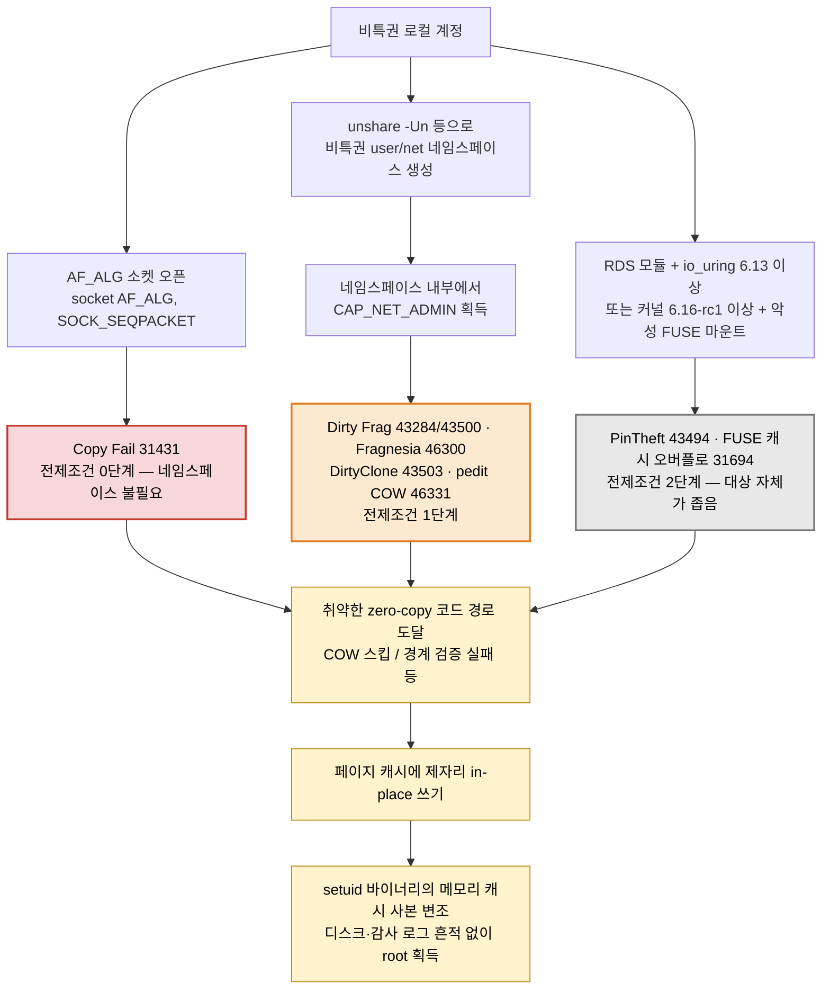

# Linux 커널 페이지 캐시 LPE 취약점 종합 대응 가이드 (Copy Fail · Dirty Frag 계열 외)

**대상 CVE**: CVE-2026-31431(Copy Fail), CVE-2026-43284/CVE-2026-43500(Dirty Frag), CVE-2026-46300(Fragnesia), CVE-2026-43503(DirtyClone), CVE-2026-46331(pedit COW), CVE-2026-43494(PinTheft), CVE-2026-31694(FUSE 디렉터리 캐시 오버플로) — 총 8건

**문서 목적**: 페이지 캐시를 제자리(in-place) 쓰기 대상으로 오용하는 이 8개 취약점의 기술적 원리와 공통점을 이해하고, 정식 패치 적용 방법과 유의사항을 정리하며, 정식 패치가 즉시 불가능한 운영 장비를 위해 [mitigate-cve-2026.sh](mitigate-cve-2026.sh) 완화 스크립트를 안전하게 활용하는 절차를 제공한다. **스크립트는 이 중 5개(31431/43284/43500/46300/43503)만 자동화 지원한다** — 나머지 3개는 5절에 수동 완화 절차만 정리했다(5.6절).

**대상 독자**: 시스템/보안 운영자, 이 스크립트를 운영 서버에 적용할 담당자

[🇺🇸 English version](pagecache-lpe-guide.en.md)

---

## 핵심 요약

- **동일 결함, 다른 경로가 8건으로 늘었다.** 전부 "파일 기반 페이지 캐시를 정상적인 쓰기 대상처럼 취급해 제자리(in-place) 쓰기를 수행"하는 동일한 실패 유형을 공유하지만, 구체적 기술 결함은 최소 4가지로 갈린다 — ①`SKBFL_SHARED_FRAG` 플래그 유실(43284/43500/46300/43503), ②AEAD 제자리 최적화 되돌림 실패(31431), ③`skb_ensure_writable()`의 COW 범위 계산 오류(46331), ④RDS 더블프리(43494)·FUSE 경계 미검증(31694) 같은 개별 결함. 트리거 경로가 서로 달라 **패치는 8개 CVE마다 별도 커밋**으로 존재한다(1절, 3.1절).
- **실제 위험도는 3단계로 갈린다 — CVE 개수가 아니라 이 순서로 대응할 것.**
  - 🔴 **1순위**: Copy Fail(31431) — 유일한 CISA KEV 등재 + 실공격 확인, 트리거에 네임스페이스조차 불필요.
  - 🟠 **2순위**: Dirty Frag(43284/43500), Fragnesia(46300), DirtyClone(43503), pedit COW(46331) — 전부 **비특권 user/net 네임스페이스로 CAP_NET_ADMIN을 얻어야 도달** 가능한 동일 전제조건을 공유하고, 공개 PoC와 벤더 RHSB(43284/43500/46300은 RHSB-2026-003, 46331은 RHSB-2026-008)가 모두 있다.
  - ⚪ **기타(현재 실발생 가능성 낮음)**: PinTheft(43494) — RDS 모듈이 대부분 배포판에 기본 미탑재. FUSE 캐시 오버플로(31694) — 커널 6.16-rc1 이상 요구로 RHEL 등 주요 배포판 전 버전 미해당. (1.1절)
- **"패치했다"가 안전을 보장하려면 관련 커밋이 전부 있어야 한다.** 특히 Fragnesia(46300)는 43284 패치가 적용된 뒤에야 비로소 익스플로잇 가능해지는 별개의 선재 결함이라, **43284만 있고 46300이 없는 커널은 오히려 더 취약할 수 있다.** DirtyClone(43503)은 "DirtyFrag+Fragnesia 체인 전체 포함"이 완전 보호의 전제조건이다(2.4절, 4.1절).
- **`uname -r` 버전 비교만으로 패치 여부를 판단할 수 없다.** 배포판은 업스트림 버전 번호를 유지한 채 보안 패치만 개별 백포트하는 경우가 많다. 배포판 어드바이저리로 CVE ID를 직접 확인해야 한다(4.2절).
- **RHEL/CentOS 미해당 CVE가 늘었다.** 43500(RxRPC)에 더해 **43494(PinTheft)·31694(FUSE)도 RHEL 6~10 전 버전 공식 미해당**이다. 반면 46331(pedit COW)은 RHEL 8/9/10에 실제 영향을 준다. 나머지도 대부분 영향을 받으며, 특히 `el9_7`·`el10_1` 마이너 스트림은 46300/43503 수정본을 받지 못해 **패키지만 최신으로 올려서는 부족하고 마이너 스트림 자체를 전환**해야 한다(4.4절).
- **정식 패치가 최선이며, 완화 스크립트는 그 전까지의 압박 완화책이다.** [mitigate-cve-2026.sh](mitigate-cve-2026.sh)의 모듈 차단 방식은 Red Hat이 RHSB-2026-003/RHSB-2026-008에서 직접 제시한 절차와 동일하다. 단, DirtyClone의 근본 결함은 커널 코어에 있어 모듈 차단만으로는 확인된 트리거(esp4/esp6)만 막을 뿐 완전한 해결책이 아니며, **스크립트 자체가 아직 pedit COW/PinTheft/FUSE 3건을 자동화하지 않는다**(5절, 5.6절).

---

## 확인 필요 (적용 전 재검증할 것)

- **CISA KEV 등재·실공격 정황·CVSS는 시점 스냅샷이다.** 아래 1.1절 표는 조사 시점 기준이며, 적용 시점에 [CISA KEV 카탈로그](https://www.cisa.gov/known-exploited-vulnerabilities-catalog)에서 8개 CVE를 재조회해야 한다.
- **벤더 어드바이저리·RHSA 번호·패키지 버전은 모두 2026-07-22 재검증 시점의 스냅샷이다.** 특히 4.4절의 RHSA 번호와 빌드 버전은 운영 반영 전 해당 erratum 페이지에서 직접 재확인할 것.
- **Oracle Linux 9(UEK)의 CVE-2026-43503 어드바이저리는 2026-07 기준 미발행.** 최신 UEK 커널이라도 이 CVE가 패치되지 않았을 수 있다.
- **CentOS Linux 7/8(전통적 CentOS, EOL)은 원 5개 CVE 전부 공식 패치가 나오지 않는다.** AlmaLinux/Rocky로 마이그레이션하거나 유상 ELS가 사실상 유일한 경로다(4.4절).
- **PinTheft(43494)·FUSE(31694)의 "기타" 분류는 현재 시점의 배포판 기본 설정 기준이다.** RDS를 활성화하거나(예: 일부 클러스터/HPC 환경) 커널을 6.16 이상으로 직접 올린 시스템이라면 등급이 달라질 수 있으니, 자산 특성에 맞게 재평가할 것(2.6절, 2.8절).
- **pedit COW(46331)의 CVSS는 판정 기관마다 권한 요구 수준(`PR`) 판단이 다르다** — kernel.org는 `PR:L`(7.8), Red Hat은 `PR:H`(6.7)로 더 낮게 본다. 실제 운영 판단은 "비특권 네임스페이스로 CAP_NET_ADMIN 획득 가능 여부"를 기준으로 할 것(2.7절).
- **2차 출처끼리, 심지어 1차 출처끼리도 어긋나는 지점이 있다.** 이 문서는 항상 1차 출처(OSV, Red Hat 보안 데이터 API)를 우선했다 — 예: RxRPC 취약 시작 버전(OSV/NVD `5.3` vs 일부 블로그의 "since ~2023"), Fragnesia의 성격(43284 패치가 낳은 회귀가 아니라 3.9부터의 선재 결함), CVE-2026-43284/43503/43494의 CVSS 벡터(OSV/kernel.org vs Red Hat 자체 벡터 불일치, 4.3절 각주·부록 참고). 의사결정에 중요하다면 1차 출처를 직접 재조회할 것.
- **changelog에 CVE ID가 없는 커널**은 "미패치"인지 "기록 자체를 안 하는 배포판"인지 로컬 정보만으로 구분 불가능하다(4.2절). `--online` 옵션 또는 수동 어드바이저리 조회로 보완할 것.
- **FUSE 건(31694)의 "연구 공개일"은 출처마다 다르게 표기된다** — NVD 등재는 2026-05-01이지만, 대중 보도가 확산된 시점은 2026-07-10 무렵이다. 이 문서는 NVD 등재일을 기준으로 삼았다(2.8절).

---

## 1. 대상 취약점 한눈에 보기

| CVE | 별칭 | 서브시스템 | 관련 모듈 | CVSS | 연구 공개일 | NVD 등재일 | 스크립트 지원 | 수정 커밋/버전 |
|---|---|---|---|---|---|---|---|---|
| CVE-2026-31431 | Copy Fail | 커널 crypto API (AF_ALG) | `algif_aead` | 7.8 | 2026-04-29 | 2026-04-22 | ✅ | `a664bf3d603d` 외 (2017년 최적화 `72548b093ee3` 되돌림) |
| CVE-2026-43284 | Dirty Frag (ESP) | IPsec ESP 입력 처리 | `esp4`, `esp6` | 8.8 (Red Hat 평가 7.8) | 2026-05-07 | 2026-05-08 | ✅ | `f4c50a4034e6` (SKBFL_SHARED_FRAG 도입) |
| CVE-2026-43500 | Dirty Frag (RxRPC) | RxRPC 프로토콜 처리 | `rxrpc` | 7.8 | 2026-05-07 | 2026-05-11 | ✅ | ESP와 별도 커밋 (서브시스템이 달라 독립 패치 필요) |
| CVE-2026-46300 | Fragnesia | ESP 경로 (`skb_try_coalesce()`) | `esp4`, `esp6` | 7.8 | 2026-05-13 | 2026-05-23 | ✅ | 43284와 별개 경로를 수정하는 독립 패치 |
| CVE-2026-43503 | DirtyClone | skb 복제 경로(커널 코어) | `esp4`, `esp6` 경유 트리거 | 8.8 (Red Hat 평가 7.0) | 2026-06-25 | 2026-05-23 | ✅ | 메인라인 머지 2026-05-21, 업스트림 v7.1-rc5(2026-05-24) 포함 |
| CVE-2026-46331 | pedit COW | tc(traffic control) `act_pedit` | `act_pedit` | 7.8(kernel.org) / 6.7(Red Hat) | 2026-06-16 | 2026-06-16 | ❌ (5.6절 수동) | v7.1-rc7 (도입 899ee91156e5, 수정 2bec122b9fb9 외) |
| CVE-2026-43494 | PinTheft | RDS zerocopy + io_uring | `rds`, `rds_tcp`, `rds_rdma` | 7.8(kernel.org) / 7.0(Red Hat) | 2026-05-21 | 2026-05-21 | ❌ (5.6절 수동) | 8개 스테이블 브랜치 패치(c6e51512a784 외) |
| CVE-2026-31694 | (FUSE 캐시 오버플로) | FUSE 디렉터리 엔트리 캐싱 | `fuse` | 7.8(kernel.org) | 2026-05-01(NVD) / 2026-07-10(보도 확산) | 2026-05-01 | ❌ (5.6절 수동) | 474ce83c96a5 외 (6.16-rc1 이상에서만 발현) |

### 1.1 위협 현황

**이 계열은 이론적 위험이 아니다.** 대응 우선순위를 정할 때 아래 표를 먼저 볼 것 — CVE 8개를 동등하게 다루지 말고, **전제조건 단계(트리거에 몇 단계가 필요한가)**를 기준으로 3그룹으로 나눠 접근한다.

| CVE | 트리거 전제조건 | 공개 PoC | CISA KEV | 실제 공격 정황 | 완화 우선순위 |
|---|---|---|---|---|---|
| **CVE-2026-31431 (Copy Fail)** | 로컬 계정만 있으면 됨(0단계) | **있음** (732바이트 Python) | **등재 — 2026-05-01** | **CISA "evidence of active exploitation in the wild"** | **🔴 1순위** |
| CVE-2026-43284 / 43500 (Dirty Frag) | 비특권 네임스페이스 → CAP_NET_ADMIN(1단계) | **있음** (단일 명령으로 root) | 미등재 | Microsoft가 in-the-wild 활동 가능성 보고 | 🟠 2순위 |
| CVE-2026-46300 (Fragnesia) | 비특권 네임스페이스 → CAP_NET_ADMIN(1단계) | 있음 (공개 시 PoC 동봉) | 미등재 | 보고 없음 | 🟠 2순위 |
| CVE-2026-43503 (DirtyClone) | 비특권 네임스페이스 → CAP_NET_ADMIN(1단계) | 익스플로잇 상세 공개(JFrog) | 미등재 | 보고 없음 | 🟠 2순위 |
| CVE-2026-46331 (pedit COW) | 비특권 네임스페이스 → CAP_NET_ADMIN(1단계) | **있음**(packet_edit_meme, 2026-06-17) | 미등재 | 보고 없음 | 🟠 2순위 |
| CVE-2026-43494 (PinTheft) | RDS 모듈 활성 + io_uring(6.13+) 등 좁은 전제(2단계) | 있음(GitHub 다수) | 미등재 | 보고 없음 | ⚪ 기타 |
| CVE-2026-31694 (FUSE 캐시 오버플로) | 커널 6.16-rc1+ 필요, 악성 FUSE 마운트(2단계) | 명시적 공개 PoC 미확인 | 미등재 | 보고 없음 | ⚪ 기타 |

`algif_aead`(Copy Fail)가 1순위인 이유는 KEV 등재만이 아니다 — 2순위 4건(43284/43500/46300/43503/46331)은 최소한 비특권 user/net 네임스페이스 생성이 필요한 반면, `AF_ALG` 소켓은 그조차 필요 없다(3.2절). **부분 적용밖에 못 하는 상황이라면 `algif_aead` 차단부터 하는 것이 맞다** — 대개 실사용이 드물어 차단 영향도 가장 낮다(반면 esp4/esp6 차단은 VPN을 끊는다).

**2순위 5건은 완화 레버가 사실상 동일하다** — 전부 비특권 user/net 네임스페이스를 막으면 트리거 경로 자체가 차단된다(3.2절). "Dirty Frag 계열"이라는 이름은 원래 43284/43500 두 건만 가리켰지만, 이 문서에서는 같은 전제조건·같은 완화 레버를 공유하는 46300/43503/46331까지 실무적으로 같은 그룹으로 묶어 다룬다.

**기타 등급 2건이 낮은 이유는 "덜 위험해서"가 아니라 "현재 실사용 분포가 좁아서"다.** PinTheft는 RDS 모듈이 대부분 배포판(RHEL/Ubuntu/Debian)에 기본 미탑재고, FUSE 건은 6.16-rc1이라는 매우 최신 커널을 요구해 RHEL을 포함한 주요 안정화 배포판이 아직 이 코드 경로 자체를 포함하지 않는다(2.6절, 2.8절, 4.4절). **RDS를 실제로 쓰는 클러스터나 최신 mainline 커널을 직접 추적하는 시스템이라면 등급을 올려 재평가해야 한다.**

---

## 2. 개별 취약점 상세

### 2.1 Copy Fail (CVE-2026-31431)

- **공개일**: 2026-04-29 (보안 업체 Theori 공개 발표). 메인라인 수정 커밋은 이보다 앞선 2026-04-01에 이미 병합됨(선패치 후공개). 커널 보안팀에는 공개 약 5주 전에 신고됨.
- **발견자**: Taeyang Lee (Theori).
- **경로**: 커널 crypto API의 사용자 공간 인터페이스인 `AF_ALG` 소켓, 특히 `algif_aead` 모듈.
- **원인**: 2017년 커밋 `72548b093ee3`이 AEAD 연산을 제자리(in-place) 방식으로 바꾼 성능 최적화가 원인. 특정 조건에서 AEAD 암호 연산이 파일 기반 페이지 위에서 제자리로 수행된다. 패치는 이 최적화를 되돌리는 방식이며, 스테이블 브랜치별로 `a664bf3d603d`·`fafe0fa2995a` 등 8개 커밋으로 배포됨.
- **트리거 조건**: 비특권 사용자가 `socket(AF_ALG, SOCK_SEQPACKET, 0)`으로 AEAD 암호 소켓을 만들 수 있으면 됨 — IPsec/VPN 설정 여부와 무관하게 도달 가능.
- **다른 4개와의 관계**: 근본 코드 경로가 나머지와 다르다. 같은 "페이지 캐시를 패킷처럼 취급" 실패 계열이지만 ESP/RxRPC 그룹과는 별개 취약점으로 분류해야 한다.

### 2.2 Dirty Frag / ESP (CVE-2026-43284)

- **공개일**: 2026-05-07
- **경로**: IPv4/IPv6 IPsec ESP 입력 처리(`esp_input()`), `esp4`/`esp6` 모듈.
- **원인**: skb(소켓 버퍼) 조각이 공유/파일 기반 페이지를 참조할 때 이를 표시하는 `SKBFL_SHARED_FRAG` 플래그가 특정 조각화(fragmentation) 경로에서 전파되지 않아, ESP 복호화가 해당 페이지에 제자리로 쓰기를 수행.
- **발견자**: Hyunwoo Kim.
- **패치**: 메인라인 커밋 `f4c50a4034e6` — `SKBFL_SHARED_FRAG` 플래그를 올바르게 도입/전파.

### 2.3 Dirty Frag / RxRPC (CVE-2026-43500)

- **공개일**: 2026-05-07 (ESP 건과 동시 공개 — Dirty Frag는 애초에 ESP/RxRPC 두 경로를 함께 다룬 연구였음)
- **경로**: RxRPC 프로토콜 스택(`rxrpc` 모듈, AFS 파일시스템 등이 사용).
- **원인**: ESP와 동일한 `SKBFL_SHARED_FRAG` 실패 패턴이지만 RxRPC 자체 경로에서 독립적으로 발생 — **ESP 패치가 RxRPC 문제를 해결해주지 않는다.** 구체적으로는 `rxrpc_input_call_event()`의 DATA 패킷 핸들러와 `rxrpc_verify_response()`의 RESPONSE 핸들러가 복호화 전에 외부 소유 페이지 조각을 unshare하지 않는 것이 원인.
- **패치 상태**: 업스트림 패치는 이미 병합 완료되어 5개 스테이블 커밋으로 배포되었고, `6.6.140` / `6.12.88` / `6.18.29` / `7.0.6` 및 v7.1 이후에 반영됨(OSV 기준). 배포판별 백포트 시점은 다를 수 있으므로 운영 환경에서는 어드바이저리로 재확인할 것.
- **Red Hat 예외**: Red Hat은 RHSB-2026-003에서 이 CVE가 자사 제품에 영향을 주지 않는다고 명시(4.4절).

### 2.4 Fragnesia (CVE-2026-46300)

- **공개일**: 2026-05-13에 발견자가 PoC 및 커널 패치와 함께 공개, 관련 보도는 2026-05-14(Dirty Frag 공개 후 채 일주일이 안 된 시점). NVD 등재는 2026-05-23.
- **경로**: skb 조각 병합 함수 `skb_try_coalesce()`. 이 함수가 페이지 조각을 다른 버퍼로 옮길 때 `SKBFL_SHARED_FRAG` 표시를 보존하지 않아, ESP 입력 처리가 해당 버퍼를 제자리 복호화해도 안전하다고 오판.
- **발견자**: William Bowling.
- **원인 — 43284 패치의 회귀 버그가 아니다**: `skb_try_coalesce()`에 **커널 3.9부터 존재해 온 선재 결함**이며(OSV/NVD의 취약 시작 버전이 3.9), 43284 패치가 ESP 입력 경로 동작을 바꾸면서 비로소 익스플로잇 가능해졌다. 두 건은 **별도 패치가 필요한 서로 다른 취약점**이다.
- **함의**: **46300 패치까지 적용된 커널만 ESP 경로에서 안전하다.** 43284만 적용한 시스템은 오히려 미적용 시스템보다 이 경로에서 더 노출될 수 있으므로, 두 패치를 함께 적용해야 한다.

### 2.5 DirtyClone (CVE-2026-43503)

- **공개일**: 패치 병합 2026-05-21(v7.1-rc5 포함), NVD 등재 2026-05-23, JFrog의 익스플로잇 상세 공개 2026-06-25 — 6월에 알려진 취약점이 아니라 5월 하순에 이미 패치와 CVE가 나와 있었다.
- **경로**: skb 복제를 수행하는 커널 코어 함수 `__pskb_copy_fclone()`, 그리고 이를 소비하는 `esp_input()`(`esp4.c`). **확인된 트리거 싱크는 ESP 경로이며 공개 익스플로잇도 이 경로를 사용한다.**
- **rxrpc는 DirtyClone의 트리거 경로가 아니다**: JFrog의 완화 권고에 `rxrpc`가 포함돼 있어 오해되지만, 이는 DirtyFrag 계열 전체에 대한 예방적 차단 대상일 뿐이다. 따라서 **43500이 미해당인 환경(예: RHEL)에서 rxrpc를 차단하지 않아도 43503 트리거 경로가 열린 채 남지 않는다.**
- **원인**: 패킷 복제 시 `SKBFL_SHARED_FRAG` 안전 플래그가 소실되어, 파일 기반(page-cache backed) 페이지가 "안전하게 쓰기 가능"으로 오판됨. ESP의 AES-CBC 제자리 복호화가 이 페이지 위에 그대로 실행되어 공격자가 원하는 바이트를 페이지 캐시에 기록 가능.
- **파급력**: 예를 들어 `/usr/bin/su`의 디스크 상 바이너리는 그대로 둔 채 **메모리 상의 페이지 캐시 사본만 조작**해 setuid 바이너리 동작을 바꿔치기할 수 있음 → 파일 무결성 검사(디스크 해시 비교)에 걸리지 않고, 별도 파일 쓰기 syscall이 없어 감사 로그에도 흔적이 남지 않음.
- **발견**: JFrog Security Research. CVSS 8.8.
- **패치**: 업스트림 v7.1-rc5(2026-05-24)부터 포함. 단, "DirtyFrag + Fragnesia 체인 전체"가 포함된 커널만 완전히 보호된다고 명시되어 있음 — DirtyClone 패치 하나만 골라 백포트해서는 안전하지 않을 수 있다.

### 2.6 pedit COW (CVE-2026-46331)

- **공개일**: 2026-06-16. 연구자 Massimiliano Oldani가 이튿날(06-17) `packet_edit_meme`라는 이름의 공개 PoC를 발표.
- **경로**: 트래픽 컨트롤(tc) 서브시스템의 패킷 헤더 편집 액션 `act_pedit` 모듈.
- **원인**: `tcf_pedit_act()`가 `skb_ensure_writable()`에 넘길 COW(제자리 복사 방지) 대상 범위를 헤더 편집 루프 **시작 전에 힌트(`tcfp_off_max_hint`)로 한 번만** 계산한다. 그런데 타입이 있는(typed) 키가 런타임에 추가하는 오프셋을 이 힌트가 반영하지 못해, 쓰기 영역 일부가 COW되지 않은 채로 남는다. 그 결과 헤더 편집이 공유 페이지 캐시에 그대로 꽂힌다. **이 CVE는 `SKBFL_SHARED_FRAG` 계열과 다른 COW 메커니즘(`skb_ensure_writable()`)의 결함**이라는 점에서 43284/43500/46300/43503과 근본 코드는 다르지만, "페이지 캐시를 쓰기 가능 대상으로 오판"하는 결과는 동일하다.
- **트리거 조건**: `CAP_NET_ADMIN`이 필요 — 대개 비특권 user/net 네임스페이스로 획득(RHEL/Debian/Ubuntu 기본 허용). Dirty Frag/Fragnesia/DirtyClone과 **완전히 동일한 전제조건**(3.2절).
- **영향 버전**: v5.18 ~ v7.1-rc6(도입 커밋 `899ee91156e5`), v7.1-rc7에서 수정.
- **벤더 대응**: Red Hat이 **RHSB-2026-008**을 별도 발행(Important 등급). 완화책으로 `act_pedit` 모듈 차단과 비특권 네임스페이스 제한 둘 다 공식 문서화 — 기존 RHSB-2026-003과 동일한 패턴.
- **CVSS 판정 차이**: kernel.org 7.8(`PR:L`) vs Red Hat 6.7(`PR:H`) — 권한 요구 수준 판단이 갈린다. 운영 판단은 CVSS 숫자보다 "비특권 네임스페이스로 CAP_NET_ADMIN 획득 가능 여부"를 기준으로 할 것.
- **스크립트 지원 여부**: 이 저장소의 [mitigate-cve-2026.sh](mitigate-cve-2026.sh)는 아직 `act_pedit`를 다루지 않는다. 수동 완화 절차는 5.6절 참고.

### 2.7 PinTheft (CVE-2026-43494)

- **공개일**: 2026-05-21(NVD).
- **경로**: RDS(Reliable Datagram Sockets) zerocopy 경로와 io_uring 고정 버퍼(`IORING_REGISTER_CLONE_BUFFERS`, 커널 6.13+)의 조합. 관련 모듈은 `rds`/`rds_tcp`/`rds_rdma`.
- **원인**: `rds_message_zcopy_from_user()`에서 `iov_iter_get_pages2()`가 실패하며 페이지 pin이 풀리는데, `op_nents` 카운터가 초기화되지 않아 이후 `rds_message_purge()`의 정리 루프에서 같은 페이지를 다시 해제하는 **더블프리**가 발생한다(CWE-1341). 이 더블프리를 io_uring 고정 버퍼와 결합하면 SUID 바이너리의 페이지 캐시 사본을 신뢰성 있게 덮어쓸 수 있다.
- **트리거 조건**: `CONFIG_RDS`/`CONFIG_RDS_TCP`가 활성화된 커널이어야 하고, 공개 PoC는 io_uring `IORING_REGISTER_CLONE_BUFFERS`가 존재하는 커널 6.13 이상을 요구한다. **RDS 모듈이 기본 탑재된 주요 배포판은 사실상 Arch Linux뿐**이며, RHEL/Debian/Ubuntu는 기본적으로 이 경로에 도달하지 않는다(아래 RHEL 항목 참고).
- **RHEL 영향**: **RHEL 6~10 전 버전 공식 "Not affected"**(Red Hat 보안 데이터 API — `package_state` 전부 Not affected, `affected_release` 없음). CloudLinux 조사에 따르면 RHEL 계열 커널 설정에 `# CONFIG_RDS is not set`이라 모듈 자체가 존재하지 않고, `socket()` 호출이 즉시 `EAFNOSUPPORT`를 반환한다. RHEL 9/10은 추가로 `kernel.io_uring_disabled=2`가 기본값이라 io_uring 자체도 비활성.
- **완화책**: RDS가 실제로 컴파일된 배포판(Ubuntu 등)에서는 `rds`/`rds_tcp`/`rds_rdma` 모듈 차단이 커뮤니티에서 검증된 완화책으로 문서화돼 있음(5.6절). Red Hat 자체 완화책 필드는 "이용 가능한 완화책 없음/기준 미충족"이라 되어 있는데, 이는 RHEL 자체가 애초에 미해당이라 나온 보일러플레이트로 판단된다 — RHEL 미해당 사실과 혼동하지 말 것.
- **낮은 우선순위 근거**: 대상 전제조건(RDS 모듈 + io_uring + 최신 커널)이 겹치는 시스템 자체가 드물어 "기타" 등급으로 분류했다. RDS를 실제로 쓰는 HPC/클러스터 환경이라면 재평가할 것.

### 2.8 FUSE 디렉터리 캐시 오버플로 (CVE-2026-31694)

- **공개일**: NVD 등재 2026-05-01. 대중 매체 보도가 확산된 시점은 2026-07-10 무렵으로, 두 날짜 사이 두 달 넘게 차이 난다(별칭 없이 CVE 번호로만 유통되는 경우가 많음).
- **경로**: FUSE(사용자 공간 파일시스템) 디렉터리 엔트리 캐싱 함수 `fuse_add_dirent_to_cache()`. 커널 내장 로직이며 별도 프로토콜 모듈이 아니다.
- **원인**: 악성 FUSE 서버가 반환하는 디렉터리 엔트리의 직렬화 크기가 **공격자가 통제하는 파일명 길이 필드**에서 유도되는데, 커널이 이 크기가 `PAGE_SIZE`(4096바이트) 안에 들어가는지 검증하지 않는다. 최대 크기 엔트리는 4120바이트에 달해 인접 커널 페이지로 **24바이트 오버플로**된다(NVD-CWE-noinfo — 상세 CWE 미분류). 앞의 43284~46331이 "COW를 건너뛰는" 실패라면, 이 CVE는 "경계 검증 자체가 없는" 실패로 **결이 다르다**.
- **트리거 조건**: 로컬 사용자가 (통상 자기 자신이 마운트하는) 악성/제어 가능한 FUSE 서버와 상호작용할 수 있어야 하며, 이 코드 경로가 존재하려면 **커널 6.16-rc1 이상**이어야 한다.
- **RHEL 영향**: **RHEL 6~10 전 버전 공식 "Not affected"**(package_state 전부 Not affected, affected_release 없음) — RHEL 커널이 이 취약점을 유발하는 대용량 FUSE readdir 버퍼 관련 변경을 아직 포함하지 않는 것으로 추정된다.
- **완화책(벤더 공식 아님, 커뮤니티 권고)**: 비특권 FUSE 마운트 제한, `fusermount3`의 setuid 비트 제거(FUSE 미사용 시스템 한정), user-namespace 정책 검토. `fuse` 모듈 자체는 sshfs/rclone/여러 Snap 패키지가 의존하므로 esp4/esp6보다 차단 범위가 넓어 **일괄 모듈 차단은 권장하지 않는다**.
- **낮은 우선순위 근거**: 요구 커널 버전(6.16-rc1+)이 이 문서 작성 시점 기준 대부분의 안정화 배포판보다 앞서 있어, 현재 실제 노출 대상이 롤링 릴리스/최신 mainline 추적 시스템으로 좁다. 배포판이 이 커널 라인을 따라잡으면 등급을 올려 재평가할 것.

---

## 3. 공통점: 근본 원리와 구조

### 3.1 공통 실패 메커니즘

리눅스 커널 네트워킹/파일 스택은 성능을 위해 데이터를 복사하지 않고 페이지를 직접 참조(zero-copy)하도록 최적화되어 있다. 그 페이지가 **파일 기반 페이지 캐시**(실행 파일 매핑, splice로 전달된 파일 데이터 등)를 가리키는 경우 함부로 그 위에 쓰면 파일 캐시 자체가 오염된다. 이를 막기 위해 커널은 "이 자원은 공유 상태이니 수정 전에 반드시 복사(copy-on-write)하라"거나 "이 크기만큼만 쓰라"는 식의 안전장치를 코드 경로마다 심어둔다.

**8개 CVE는 "결과"는 같지만 "구체적 기술 결함"은 하나가 아니다** — 최소 4개 계열로 갈린다.

| 결함 계열 | 메커니즘 | 해당 CVE |
|---|---|---|
| `SKBFL_SHARED_FRAG` 플래그 유실 | skb 조각이 공유/파일 기반 페이지를 참조함을 표시하는 플래그가 조각화·병합·복제·재조립 경로 중 하나에서 전파되지 않음 | 43284, 43500, 46300, 43503 |
| AEAD 제자리 최적화 되돌림 실패 | 2017년 성능 최적화가 파일 기반 페이지 위에서 암호 연산을 제자리로 수행하게 만듦 | 31431 |
| `skb_ensure_writable()` COW 범위 계산 오류 | COW 대상 범위를 편집 루프 시작 전에 한 번만(부정확하게) 계산해 일부 쓰기 영역이 COW되지 않음 | 46331 |
| 개별 결함(더블프리·경계 미검증) | RDS zerocopy 카운터 미초기화로 인한 더블프리, FUSE 엔트리 크기 미검증으로 인한 오버플로 — 서로 무관한 별개 버그이지만 결과적으로 페이지 캐시에 제자리 쓰기가 일어남 | 43494, 31694 |

즉 이 문서의 "공통점"은 **단일 버그의 여러 변종이 아니라, "파일 기반 페이지를 안전하지 않게 취급한다"는 동일한 실패 패턴이 커널 곳곳에서 독립적으로 반복 발견되고 있다**는 것이다(3.3절 계보 참고). `SKBFL_SHARED_FRAG` 유실은 그중 가장 큰 하위 계열(4건)일 뿐, 전체를 대표하는 단일 메커니즘은 아니다.

### 3.2 자주 하는 오해: "이 기능을 안 쓴다"는 안전을 보장하지 않는다

2절의 "경로/트리거 조건"은 **취약한 코드가 어느 서브시스템에 있는지**를 설명한 것이지, "관리자가 그 기능을 활성화해서 쓰고 있어야만 위험하다"는 뜻이 아니다.

- **정책적 미사용**(관리자가 IPsec/VPN/AF_ALG를 설정하지 않았다는 것)은 커널 관점에서 아무 의미가 없다. 패치되지 않은 커널이라면 해당 코드는 여전히 서버 안에 존재한다.
- **기술적 도달 불가능**(코드 자체가 없거나 호출 경로가 차단된 것)만이 실제 방어 효과를 갖는다.

`algif_aead`(Copy Fail)는 IPsec/VPN 설정과 완전히 무관하다 — `socket(AF_ALG, SOCK_SEQPACKET, 0)`은 어떤 권한 검사도 없이 로컬 계정이면 누구나 호출 가능하다. `esp4`/`esp6`/`rxrpc`/`act_pedit`(pedit COW) 경로도, 정식 사용 시 보통 `CAP_NET_ADMIN`이 필요하지만 대부분의 배포판이 기본 허용하는 비특권 user/net 네임스페이스(`unshare -Un` 등) 안에서는 일반 계정도 사실상 관리자 권한으로 해당 코드에 도달할 수 있다. 즉 **이미 낮은 권한 계정이 침해된 상태라면, 관리자의 "미사용" 정책과 무관하게 공격자가 그 기능을 직접 호출해 취약점을 악용할 수 있다.** 2순위 5건(43284/43500/46300/43503/46331)이 전부 이 논리에 해당하므로, **비특권 user/net 네임스페이스 제한 하나가 5건 모두에 동시에 효과가 있는 공통 레버**다(5.6절 참고 — 단 46331은 스크립트가 아직 자동화하지 않아 수동 적용 필요).

[mitigate-cve-2026.sh](mitigate-cve-2026.sh)의 모듈 차단(`install ... /bin/false`)이 실질적 방어가 되는 이유가 여기에 있다 — 커널의 모듈 자동 로드 메커니즘(`request_module()`) 자체를 실패시켜 **호출자의 권한과 무관하게 해당 코드 경로를 원천적으로 도달 불가능하게 만드는** 기술적 조치이기 때문이다. 반대로 대상 코드가 빌트인(`=y`)인 경우 이 방어가 통하지 않는 것도 같은 논리다 — 애초에 차단할 "로드 단계"가 없다(5.5절).

> **이 접근은 벤더 공식 권고와 동일하다.** Red Hat은 RHSB-2026-003에서 즉시 패치가 불가능한 시스템에 아래를 완화책으로 직접 제시한다.
>
> ```
> printf 'install esp4 /bin/false\ninstall esp6 /bin/false\n' > /etc/modprobe.d/dirtyfrag.conf
> rmmod esp4 esp6 2>/dev/null; true
> ```
>
> 이 저장소의 스크립트는 이 절차에 사전 점검, 배포판 패치 판정, 사용 신호 탐지, 사후 검증을 추가해 자동화·안전장치화한 것이다. 변경관리 승인(5.4절) 근거로 제시할 수 있다. 다만 Red Hat도 "esp4/esp6 차단은 IPsec 기능을 중단시킨다"고 경고하며, IPsec이 필요한 시스템에는 비특권 user namespace 비활성화를 대안으로 제시한다는 점까지 함께 인용해야 한다.

RHEL/CentOS가 RxRPC(43500)에서 예외인 것과 "관리자가 안 쓰기로 했다"는 이유로 예외라고 주장하는 것은 전혀 다른 근거다. 전자는 배포판 차원에서 확인된 기술적 사실이고, 후자는 방어 효과가 없는 정책적 착각이다.

Red Hat은 그 사유까지 공식적으로 밝혀 두었다. 보안 데이터의 statement에 따르면 RHEL 9/10 커널 소스 config에는 rxrpc가 존재하지만 **이 모듈을 제공하는 바이너리 RPM을 Red Hat이 출하·지원하지 않는다.** 기본 설치되지 않으며 지원 커널 패키지와 RHCOS 이미지 어디에도 포함되지 않는다. Oracle Linux(UEK)도 `# CONFIG_AF_RXRPC is not set`으로 동일하다.

#### 트리거 경로 한눈에 보기

전제조건 단계 수가 곧 우선순위를 결정한다는 것을 아래 다이어그램으로 요약한다 — 단계가 적을수록(=공격자에게 필요한 준비가 적을수록) 우선순위가 높다.



**읽는 법**: 세 경로 모두 결국 "페이지 캐시 제자리 쓰기 → root"라는 동일한 결과에 도달하지만, 거기까지 가는 데 필요한 전제조건 단계 수가 다르다. Copy Fail은 소켓 하나만 열면 끝(0단계)이라 1순위, 나머지 2순위 5건은 네임스페이스 생성이라는 공통 관문 하나를 거쳐야 하며(1단계, 3.2절 논리 그대로), 기타 2건은 그 관문 외에 모듈·커널 버전 같은 추가 전제조건이 더 필요하다(2단계). **이 완화 스크립트가 비특권 네임스페이스를 막는 조치 하나로 2순위 5건에 동시에 효과를 내는 이유**도 이 다이어그램에서 그대로 드러난다 — 5건 모두 같은 관문을 지나야 하기 때문이다.

### 3.3 계보: 왜 이런 류의 버그가 반복되는가

이 계열은 리눅스 커널에서 오래전부터 반복되어 온 "페이지 캐시 제자리 쓰기(page cache corruption)" 취약점 계보의 연장선이다.

```
Dirty COW (2016, CVE-2016-5195)
   └─ COW 레이스 컨디션으로 읽기전용 페이지에 쓰기 성공
Dirty Pipe (2022, CVE-2022-0847)
   └─ 파이프 버퍼 플래그 초기화 누락으로 페이지 캐시 직접 덮어쓰기
Dirty Cred
   └─ 커널 자격증명(credential) 객체 재사용 결함
Dirty Frag 계열 (2026, SKBFL_SHARED_FRAG 유실)
   └─ Copy Fail(31431, AEAD 제자리 최적화 되돌림 실패로 계열에 합류)
   └─ Dirty Frag/ESP(43284), Dirty Frag/RxRPC(43500)
   └─ Fragnesia(46300, skb_try_coalesce())
   └─ DirtyClone(43503, __pskb_copy_fclone())
   └─ pedit COW(46331, skb_ensure_writable() COW 범위 계산 오류 — 다른 메커니즘, 같은 결과)
페이지 캐시 개별 결함 (2026, 위와 무관한 별개 버그)
   └─ PinTheft(43494, RDS zerocopy 더블프리 + io_uring)
   └─ FUSE 캐시 오버플로(31694, 디렉터리 엔트리 경계 미검증)
```

핵심 교훈: "복사해야 할 자리에서 실수로 제자리 쓰기가 일어난다"는 패턴 자체가 리눅스 네트워킹/메모리 서브시스템에 구조적으로 반복 출현하는 버그 클래스이며, 한 번의 완전한 수정으로 영구히 끝나기보다는 관련 경로가 발견될 때마다 후속 변종이 계속 나올 가능성을 염두에 둬야 한다. PinTheft·FUSE 건은 `SKBFL_SHARED_FRAG` 계열과 기술적으로 무관한데도 같은 시기에 같은 결과(페이지 캐시 제자리 변조)로 독립적으로 발견됐다는 사실 자체가, 이 패턴이 특정 플래그 하나의 문제가 아니라 **커널 전반의 zero-copy 최적화 지점마다 반복되는 구조적 위험**임을 보여준다.

`SKBFL_SHARED_FRAG` 플래그를 보존해야 하는 지점이 커널 곳곳에 흩어져 있다는 것이 구조적 문제다. 조각화(43284), 병합 `skb_try_coalesce()`(46300), 복제 `__pskb_copy_fclone()`(43503), 프로토콜별 재조립(43500) — 한 곳을 고쳐도 나머지가 남는다. Fragnesia가 43284 패치 적용 이후에야 익스플로잇 가능해진 사례(2.4절)는, 한 경로의 수정이 다른 경로의 잠재 결함을 드러내거나 활성화할 수 있다는 것까지 보여준다.

### 3.4 왜 특히 위험한가

- **권한 상승 자체가 로컬**이라 원격 코드실행 없이도, 이미 낮은 권한을 가진 프로세스(컨테이너 이탈, 웹쉘, 침해된 서비스 계정 등)가 즉시 root로 상승 가능.
- **디스크 상 파일은 그대로 두고 메모리(페이지 캐시) 사본만 변조**하는 방식이 많아, 파일 무결성 모니터링(AIDE, Tripwire 등)이나 디스크 해시 비교로 탐지되지 않음.
- 별도 파일 쓰기 syscall이 발생하지 않는 경로가 있어 auditd 등 표준 감사 로그에도 흔적이 남지 않을 수 있음.

---

## 4. 패치 적용 방법 및 유의사항

### 4.1 "체인" 개념 이해 — 단일 패치가 아니다

원 5개 CVE는 5개의 서로 다른 커밋이다. "커널을 업데이트했다"는 말이 안전을 보장하려면 이 5개가 전부 포함된 버전이어야 한다.

- Copy Fail은 나머지와 근본 코드 경로가 달라 독립적으로 반드시 확인해야 한다.
- Dirty Frag(ESP)와 Dirty Frag(RxRPC)는 이름은 같지만 별개 커밋이다.
- Fragnesia는 43284 패치가 적용된 뒤에야 익스플로잇 가능해지는 별개 경로의 결함이므로, 43284만 있고 46300이 없는 커널은 여전히 취약하다(2.4절).
- DirtyClone은 "DirtyFrag+Fragnesia 체인 전체 포함"이 전제조건이다.

**추가로 확인된 3건(pedit COW/PinTheft/FUSE)은 이 5개 체인에 속하지 않는 별개 커밋이다.** 위 5개를 전부 패치했다고 해서 이 3건이 함께 해결되지 않으며, 반대로 이 3건을 패치했다고 원 5개 체인이 완성되지도 않는다 — CVE ID별로 독립적으로 확인해야 한다. 다만 pedit COW/PinTheft도 각자 "취약 시작 버전"과 "실제 익스플로잇 가능해진 시점"이 다른, Fragnesia와 유사한 패턴을 보인다(2.6절, 2.7절, 4.3절).

### 4.2 버전 비교만으로 안전 여부를 판단하지 말 것

`uname -r` 버전 문자열을 업스트림 픽스 버전과 단순 비교하는 방식은 배포판 커널에서는 신뢰할 수 없다. Ubuntu/RHEL/Debian 등은 업스트림 버전 번호를 유지한 채 보안 패치만 개별 백포트하는 경우가 많다.

**권장 확인 절차**:
1. 배포판별 보안 어드바이저리에서 8개 CVE ID를 각각 검색 (Ubuntu USN, RHEL RHSA, Debian DSA, SUSE-SU 등).
2. 패키지 변경 이력 확인:
   - Debian/Ubuntu: `apt changelog linux-image-$(uname -r)` 후 CVE ID grep
   - RHEL/CentOS/Fedora: `rpm -q --changelog kernel-$(uname -r)` 후 CVE ID grep
   - SUSE: 해당 SUSE-SU 어드바이저리 대조
3. 원 5개 CVE ID **전부**가 확인되어야 "완전히 패치됨"으로 판단. pedit COW/PinTheft/FUSE 3건은 별개 체인이므로 각자 개별 확인.
4. 자동화 도구가 있다면 활용: Ubuntu `ubuntu-security-status` / `pro fix CVE-XXXX --dry-run`, RHEL `oscap` 등.

**[mitigate-cve-2026.sh](mitigate-cve-2026.sh)가 위 2~3번을 자동화한다 — 단 원 5개 CVE에 한해서다.** 레드햇 계열은 `rpm -q --changelog`, 데비안/우분투 계열은 dpkg changelog를 조회한다(5.1절). pedit COW/PinTheft/FUSE는 스크립트가 아직 확인하지 않으므로 수동으로 위 절차를 적용해야 한다(5.6절).

#### changelog에 CVE ID가 없을 때

이 경우 로컬 판정은 전부 `[미확인]`이 된다. 원인은 둘인데 로컬 정보만으로는 구분할 수 없다.

- **아직 패치되지 않았다** — 대부분 이쪽이다. 커널 빌드 시점이 CVE 공개보다 앞서면 changelog에 있을 수가 없다.
- **기록하지 않는다** — 일부 커뮤니티/SBC 배포판처럼 changelog 자체가 자동 생성된 한 줄(`Initial changelog entry for ...`)이라 기록할 자리가 없는 경우.

따라서 "CVE가 없다"를 "이 배포판은 CVE를 기록하지 않는다"로 넘겨짚지 말 것. 주요 배포판은 대부분 정확히 기록한다 — Oracle UEK도 Orabug 번호와 함께 남긴다.

```
- crypto: algif_aead - Revert to operating out-of-place (Herbert Xu)
    [Orabug: 39250686,39283867,39291961] {CVE-2026-31431}
```

스크립트가 이 상태를 "미패치"가 아니라 `[미확인]`으로 두고 조치 대상에 남기는 것은 의도된 fail-safe다(증명할 수 없으면 조치 대상으로 간주). 두 원인을 구분해 주는 것이 `--online`이다.

#### 해법: `--online` — 벤더 어드바이저리 조회

`dnf updateinfo`로 "수정본이 배포됐는데 이 시스템에 설치되지 않은" CVE를 취약 확정한다. 핵심은 버전 비교를 문서나 스크립트가 직접 하지 않는다는 점이다 — 어떤 빌드가 수정본인지는 벤더만 알고, 설치본과의 비교는 패키지 관리자가 해 준다. 하드코딩 표를 만들면 UEK 같은 자체 버전 체계에서 반드시 틀린다.

판정은 의도적으로 비대칭이다 — 어드바이저리가 있으면 취약 확정(강한 근거), 없으면 아무 판정도 하지 않는다. 어드바이저리 부재는 메타데이터 누락·리포 미설정·미해당을 구분할 수 없어서, 이를 "패치됨"으로 읽으면 fail-open이 된다.

네트워크를 쓰므로 기본값은 오프라인이며 `--online`을 명시해야 동작한다.

> ⚠️ **Oracle Linux UEK 주의점 3가지**
> - **4.3절 버전 표를 쓸 수 없다.** UEK는 업스트림 포인트 릴리스를 따르지 않고 `5.15.0` 고정에 자체 빌드번호를 붙인다(`5.15.0-322.203.3.4.el9uek`). `5.15.208`과 비교하면 항상 "취약"으로 읽히지만 근거 없는 판정이다.
> - **커널 패키지명이 다르다.** `kernel-core`/`kernel`이 아니라 `kernel-uek-core`다.
> - **ELSA를 혼동하지 말 것.** `dnf updateinfo list --cve`가 보여주는 ELSA는 RHCK(`kernel-5.14.0-…el9_7`) 기준인 경우가 있어 UEK 장비에 그대로 적용되지 않는다. 자신이 UEK인지 RHCK인지부터 확인해야 한다.

> ℹ️ **changelog에 기록 자체가 없는 커널**에서는 판정이 구조적으로 불가능하므로 4.3절의 업스트림 버전 표가 더 신뢰할 수 있는 신호다. 단, 벤더가 업스트림 stable을 그대로 따라간 경우에만 유효하니 릴리스 노트로 교차 확인할 것.

### 4.3 업스트림 커널 영향 버전 범위 (OSV/NVD 기준, 2026-07-22 재검증)

CVE ID로 검색하는 것과 별개로 "정확히 몇 버전부터 몇 버전까지"가 궁금하다면 아래 버전 범위를 참고한다. **주의**: 이는 업스트림(vanilla) 커널 기준이며, 배포판 커널은 백포트 방식이 달라 이 번호를 그대로 적용할 수 없다(4.2절) — 어디까지나 "노출 범위가 얼마나 넓은지" 감을 잡는 용도다.

| CVE | 취약 시작 버전 | 브랜치별 수정 지점(이 버전 **미만**이면 취약) |
|---|---|---|
| CVE-2026-31431 (Copy Fail) | 4.14 | 5.10.254 / 5.15.204 / 6.1.170 / 6.6.137 / 6.12.85 / 6.18.22 / 6.19.12 |
| CVE-2026-43284 (Dirty Frag/ESP) | 4.11 | 5.10.255 / 5.15.205 / 6.1.171 / 6.6.138 / 6.12.87 / 6.18.28 / 7.0.5 |
| CVE-2026-43500 (Dirty Frag/RxRPC) | 5.3 | 6.6.140 / 6.12.88 / 6.18.29 / 7.0.6 |
| CVE-2026-46300 (Fragnesia) | 3.9 | 5.10.257 / 5.15.208 / 6.1.174 / 6.6.141 / 6.12.91 / 6.18.33 / 7.0.10 (7.1-rc1~rc4도 취약) |
| CVE-2026-43503 (DirtyClone) | 3.9 | 5.10.257 / 5.15.208 / 6.1.174 / 6.6.141 / 6.12.91 / 6.18.33 / 7.0.10 (7.1-rc1~rc4도 취약) |
| CVE-2026-46331 (pedit COW) | 5.18 | v7.1-rc7 (정확한 브랜치별 포인트 릴리스는 미정리 — 배포판 어드바이저리로 개별 확인) |
| CVE-2026-43494 (PinTheft) | 4.17(코드상 결함 존재 시작) | 5.10.257 / 5.15.208 / 6.1.174 / 6.6.140 / 6.12.90 / 6.18.32 / 7.0.9 — **단 io_uring `IORING_REGISTER_CLONE_BUFFERS`가 필요해 실제 익스플로잇은 커널 6.13 이상에서만 성립**(Fragnesia와 유사하게 "취약 시작"과 "익스플로잇 가능 시점"이 다른 사례, 2.7절) |
| CVE-2026-31694 (FUSE 캐시 오버플로) | 4.20(코드상 결함 존재 시작) | 5.10.258 / 5.15.209 / 6.1.175 / 6.6.136 / 6.18.25 / 7.0.2 — **단 대용량 readdir 버퍼로 실제 도달 가능해진 것은 커널 6.16-rc1부터**(같은 패턴, 2.8절) |

**읽는 법**: 브랜치마다 별도 포인트 릴리스로 백포트되므로(예: `6.1.171 미만`은 6.1 계열에서만 유효), 메이저 버전만 보지 말고 자신의 브랜치의 포인트 릴리스 번호까지 확인해야 한다. 종합하면 원 5개 CVE를 합친 이론적 노출 범위는 커널 3.9 ~ 7.1-rc4로, Fragnesia/DirtyClone이 가장 오래된 커널까지 걸쳐 있다.

> 46300과 43503이 동일한 포인트 릴리스인 것은 오타가 아니다 — 두 건이 같은 스테이블 릴리스 사이클에 함께 반영되었다.

> **"취약 시작 버전"과 "실제 익스플로잇 가능 시점"을 혼동하지 말 것.** PinTheft·FUSE 캐시 오버플로는 코드상 결함 자체는 오래됐지만(각각 4.17, 4.20부터), 이를 실제로 악용하려면 각각 io_uring 고정 버퍼 기능(6.13+)·대용량 FUSE readdir 버퍼(6.16-rc1+)라는 **나중에 추가된 다른 기능이 필요**하다. Fragnesia가 43284 패치 이후에야 익스플로잇 가능해진 것과 같은 구조다(2.4절) — "오래된 커널이라 안전하다"고 단순히 판단하지 말 것.

### 4.4 RHEL/CentOS 계열 상세 정보

**배포판 구조상 주의할 점**: "CentOS"가 무엇을 가리키는지에 따라 대응이 완전히 달라진다.
- **CentOS Stream 9/10**: RHEL 9/10의 업스트림 롤링 배포판 — RHEL과 사실상 동일하게 패치됨.
- **CentOS Linux 7/8 (전통적 CentOS)**: 이미 EOL(각각 2024-06, 2021-12 종료)이라 이 5개 CVE 전부 공식 패치가 나오지 않는다. AlmaLinux/Rocky로 마이그레이션하거나 TuxCare/CloudLinux 같은 유상 ELS(Extended Lifecycle Support)가 사실상 유일한 패치 경로다.
- **AlmaLinux / Rocky Linux**: RHEL 바이너리 호환 재배포판 — RHEL과 거의 동시에 패치 배포.

**CVE별 RHEL 영향 여부**:

| CVE | RHEL 7 | RHEL 8 | RHEL 9 | RHEL 10 |
|---|---|---|---|---|
| 31431 (Copy Fail) | **미해당** | 영향 있음 | 영향 있음 → `kernel-5.14.0-611.54.1.el9_7`(RHSA-2026:13565, 초기 빌드) | 영향 있음 |
| 43284 (Dirty Frag/ESP) | **미해당** | 영향 있음 | 영향 있음 | 영향 있음 → `kernel-6.12.0-211.16.1.el10_2`(RHSA-2026:19569) |
| 43500 (Dirty Frag/RxRPC) | **미해당** | **미해당** | **미해당** | **미해당** — RHSB-2026-003에서 "does not affect Red Hat products" 명시 |
| 46300 (Fragnesia) | **미해당** | 영향 있음 | 영향 있음 | 영향 있음 |
| 43503 (DirtyClone) | **미해당** | **영향 있음** → RHSA-2026:19666(kernel) / 19664(kernel-rt) | 영향 있음(CVSS 7.0) | 영향 있음 |
| 46331 (pedit COW) | **미해당** | 영향 있음 → `kernel-4.18.0-553.143.1.el8_10`(RHSA-2026:27353) | 영향 있음(RHSB-2026-008) | 영향 있음 → `kernel-6.12.0-211.26.1.el10_2`(RHSA-2026:27288) |
| 43494 (PinTheft) | **미해당** | **미해당** | **미해당** | **미해당** — `package_state` 전 제품 Not affected, `affected_release` 없음. CONFIG_RDS 자체가 RHEL 커널에 없음(2.7절) |
| 31694 (FUSE 캐시 오버플로) | **미해당** | **미해당** | **미해당** | **미해당** — `package_state` 전 제품 Not affected. 대용량 FUSE readdir 버퍼 관련 변경 미포함으로 추정(2.8절) |

> **버전 번호를 가로로 비교하지 말 것**: 위 표의 `kernel-6.12.0-211.16.1.el10_2`(10.2 스트림)와 아래의 `kernel-6.12.0-124.56.1.el10_1`(10.1 스트림)은 서로 다른 마이너 스트림이라 숫자 크기를 직접 비교하면 안 된다(`124` < `211`이지만 el10_1이 더 낮은 버전이라는 뜻이 아니다). RHEL은 마이너 릴리스별로 독립된 커널 라인을 유지하므로, 자신이 붙어 있는 스트림(`el9_7`, `el10_1`, `el10_2` 등) 안에서만 버전을 비교해야 한다.
>
> 표에 적힌 RHSA 번호와 패키지 버전은 운영 반영 전 해당 erratum 페이지에서 직접 확인할 것.

> ⚠️ **`el9_7`·`el10_1` 스트림은 46300/43503 수정본을 받지 못했다**(Red Hat 보안 데이터 재확인). 두 스트림 모두 31431·43284까지만 반영되고 멈췄다 — `el9_7`의 마지막 빌드는 `kernel-5.14.0-611.55.1.el9_7`(RHSA-2026:16206, 43284까지), `el10_1`의 마지막 빌드는 `kernel-6.12.0-124.56.1.el10_1`(RHSA-2026:16062, 43284까지)이다. 패키지만 최신으로 올려서는 46300/43503이 해결되지 않으며, 마이너 스트림 자체를 전환해야 한다:
>
> | 목표 | 스트림 | 4개 CVE(31431/43284/46300/43503) 모두 포함된 빌드 | 근거 |
> |---|---|---|---|
> | RHEL 8 | `el8_10`(단일 스트림) | `kernel-4.18.0-553.125.1.el8_10` | RHSA-2026:19666(kernel-rt는 RHSA-2026:19664) |
> | RHEL 9 | `el9_8` | `kernel-5.14.0-687.10.1.el9_8` | RHSA-2026:19568 |
> | RHEL 10 | `el10_2` | `kernel-6.12.0-211.16.1.el10_2` | RHSA-2026:19569 |
>
> 스트림 전환은 `dnf update`만으로 끝나지 않고 `subscription-manager`로 EUS 구독을 바꿔야 할 수 있다 — 마이너 릴리스 업그레이드에 준하는 작업이므로 변경관리 절차도 그에 맞게 잡을 것.

#### 1차 출처: Red Hat 보안 데이터 API

위 표의 근거다. CVE ID별 제품별 상태를 기계 판독 가능한 형태로 제공하므로 블로그·보도보다 우선해야 한다.

```
https://access.redhat.com/hydra/rest/securitydata/cve/CVE-2026-43503.json
```

`package_state`(미수정 상태) / `affected_release`(수정본 출하됨) 두 필드를 함께 봐야 한다 — 어느 쪽에도 없으면 "미해당"이 아니라 "정보 없음"이다.

[mitigate-cve-2026.sh](mitigate-cve-2026.sh)가 하드코딩하는 "해당없음" 예외는 CVE-2026-43500 하나뿐이며, 근거는 다음과 같다.

- `package_state`: RHEL 6/7/8/9/10 및 OpenShift 전부 `Not affected`
- `affected_release`: 항목 없음
- Red Hat statement: *RHEL 9/10 커널 소스 config에는 rxrpc가 있으나, 이 모듈을 제공하는 바이너리 RPM은 Red Hat이 출하·지원하지 않는다*

> ⚠️ **완화를 건너뛰는 판단은 1차 출처로만 할 것.** 2차 출처에는 "43503은 RHEL 8 미해당"처럼 사실과 다른 서술이 돌아다닌다(실제로는 Affected이며 RHSA-2026:19664 등 수정본이 출하됐다). 이런 서술을 근거로 조치를 생략하면 영향받는 시스템이 그대로 남는다.

### 4.5 재부팅 vs 라이브패치

- **일반 커널 업데이트**: 새 커널 설치 후 재부팅 필요. 가장 확실하지만 운영 중단(또는 유지보수 창) 필요.
- **라이브패치(kpatch/Ubuntu Livepatch/kGraft)**: 배포판이 해당 CVE에 대한 라이브패치를 제공하면 재부팅 없이 즉시 적용 가능. 이번 계열은 공개 직후 KernelCare 등에서 EL 계열에 24시간 내 라이브패치를 배포한 사례가 있었던 만큼, 사용 중인 배포판/구독 상품에 라이브패치 옵션이 있는지 먼저 확인할 가치가 있다.
- 라이브패치는 어디까지나 정식 커널 업데이트 전까지의 가교이며, 다음 정기 재부팅/유지보수 시 정식 커널로 전환하는 일정은 별도로 잡아야 한다.

### 4.6 패치 후 검증 시 유의사항

- 패치가 여러 서브시스템(ESP, RxRPC, AF_ALG, skb 코어)에 걸쳐 있으므로, 실사용 중인 IPsec 터널·AFS 마운트·AF_ALG 기반 애플리케이션(예: 일부 `cryptsetup`/OpenSSL engine 구성)이 있다면 패치 적용 후 기능 회귀 여부를 스테이징 환경에서 먼저 검증할 것을 권장한다. Fragnesia 사례에서 보듯 이 계열 패치들은 서둘러 나온 만큼 후속 회귀 가능성이 이례적으로 높았던 이력이 있다.
- 패치 적용 후에도 [본 스크립트](mitigate-cve-2026.sh)의 사전 점검 단계(모듈 로드 상태 확인)를 재실행해 상태를 기록해두면 변경 이력 추적에 도움이 된다.

---

## 5. 즉시 패치가 어려운 운영 환경 — 완화 스크립트 활용법

상용 서비스 중인 장비는 재부팅/커널 교체를 위한 변경 승인, 유지보수 창 확보에 시간이 걸리는 경우가 많다. 이 구간을 메우기 위해 [mitigate-cve-2026.sh](mitigate-cve-2026.sh)를 임시 압박 완화책(compensating control)으로 사용할 수 있다. **패치를 대체하는 것이 아니라, 패치 적용 전까지 공격 표면을 줄이는 용도임을 반드시 인지할 것.**

> **범위 안내**: 이 5절(5.1~5.5)은 스크립트가 실제로 자동화하는 **원 5개 CVE**(31431/43284/43500/46300/43503)에 한정된다. 추가로 확인된 pedit COW(46331)·PinTheft(43494)·FUSE 캐시 오버플로(31694) 3건은 스크립트가 아직 다루지 않으며, 수동 완화 절차는 5.6절에 별도로 정리했다.

### 5.1 스크립트가 커버하는 범위

| 조치 | 대응 CVE | 방식 |
|---|---|---|
| `esp4`/`esp6` 자동로드 차단 + 언로드 | 43284, 46300, 43503 | `install .../bin/false` + `blacklist` + `modprobe -r` |
| `rxrpc` 자동로드 차단 + 언로드 | 43500 | 동일 방식 |
| `algif_aead` 자동로드 차단 + 언로드 | 31431 | 동일 방식 |
| 빌트인(=y) 감지 및 경고 | 5개 전체(트리거 경로 판단용) | `/boot/config-$(uname -r)` 확인 |
| **배포판 패치 자동 확인 + 이미 패치된 모듈 스킵** | 5개 전체 | 레드햇 계열: `rpm -q --changelog` / 데비안·우분투 계열: dpkg changelog. 전부 오프라인(기본값). 4.3/4.4절 참고 |
| **벤더 보안 어드바이저리 조회(`--online`)** | 5개 전체 | 레드햇 계열: `dnf updateinfo`로 "수정본 배포됐으나 미설치"인 CVE를 취약 확정. changelog에 CVE ID가 없는 커널(Oracle UEK 등)에서 유일한 확정 수단. 데비안 계열: `apt changelog` 폴백. 4.2절 참고 |
| **VPN/IPsec·RxRPC/AFS·컨테이너 사용 신호 탐지(참고 정보)** | 의사결정 보조 | `ip xfrm state/policy`, IKE 포트, strongswan/libreswan 서비스, AFS 마운트, docker/podman/containerd/kubelet 등 확인(전부 휴리스틱, 차단 여부를 대신 결정하지 않음) |
| 비특권 user/net 네임스페이스 제한(선택) | 43284 / 46300 / 43503 (ESP 경로). **31431에는 효과 없음** | `kernel.unprivileged_userns_clone=0` / `user.max_user_namespaces=0`. 적용 전 원래 값을 설정 파일 주석에 기록 |
| **결론 중심 요약 출력** | — | 기본은 진단(취약 확정/확인 불가/해당없음)과 우선순위별 조치만 출력. 근거는 `--verbose` |
| **원복(rollback)** | — | `--rollback`으로 생성한 modprobe/sysctl 설정 삭제 및 sysctl 원래 값 복원 |

> ⚠️ **네임스페이스 제한은 `algif_aead`(CVE-2026-31431)를 막지 못한다.** 이 조치는 "비특권 사용자가 net namespace를 만들어 ESP/RxRPC 코드에 도달하는 것"을 차단하는 것인데, `AF_ALG` 소켓은 네임스페이스 없이 로컬 계정이면 누구나 열 수 있기 때문이다(3.2절). 빌트인 대상이 `algif_aead`뿐인 시스템에서 이 조치를 적용하면 컨테이너·샌드박스만 깨뜨리고 정작 KEV 등재 CVE는 하나도 막지 못한다. 스크립트는 이 경우를 감지해 조치를 제안하지 않고, 패치가 사실상 유일한 대안임을 안내한다.

### 5.1-1 명령행 인터페이스

```bash
sudo bash mitigate-cve-2026.sh --dry-run            # 변경 없이 점검만(진단+조치 요약)
sudo bash mitigate-cve-2026.sh --dry-run --verbose  # + 판정 근거 전체
sudo bash mitigate-cve-2026.sh --dry-run --online   # + 벤더 어드바이저리 조회
sudo bash mitigate-cve-2026.sh                      # 대화형 적용
sudo bash mitigate-cve-2026.sh --yes                # 비대화형 적용(Ansible/CI)
sudo bash mitigate-cve-2026.sh --rollback           # 원복
```

> **네트워크는 기본적으로 쓰지 않는다.** `--online`을 줄 때만 벤더 어드바이저리(`dnf updateinfo`)와 `apt changelog` 폴백이 동작한다. 운영 서버에서 실행되는 스크립트가 묻지 않고 외부 통신을 하지 않도록 한 설계이며, 망분리 환경에서는 기본값 그대로 쓰면 된다.

**종료 코드**: `0` 조치 불필요 / `1` 오류 / `2` 잘못된 인자 / `10` 조치 필요(dry-run 또는 사용자 취소) / `20` 변경 적용함.

자산 스캔 용도라면 `--dry-run`을 돌리고 종료 코드 `10`인 호스트만 수집하면 된다. Ansible에서는 `--yes`와 함께 `failed_when: rc not in [0, 20]`으로 연결한다.

> **root 필수**: 비root로 실행하면 스크립트가 거부한다. `ip xfrm` 등 권한이 필요한 탐지가 조용히 실패해 실제로는 IPsec을 쓰는 서버를 "미사용"으로 오판할 수 있기 때문이다. 같은 이유로, 탐지에 실패한 항목은 "신호 없음"이 아니라 `[확인불가]`로 따로 표시된다.

### 5.2 실행 전 반드시 확인할 사전 조건

- **IPsec/VPN을 실제로 사용하지 않는지** 네트워크팀과 재확인. 사용 중이라면 `esp4`/`esp6`/`rxrpc` 차단은 서비스 중단을 유발한다. 스크립트가 `ip xfrm`/IKE 포트/strongswan 등을 자동 확인해 신호를 보여주지만 어디까지나 휴리스틱이다 — 신호가 없다고 곧바로 "미사용 확정"으로 판단하지 말고 담당자 확인을 병행할 것.
- **AF_ALG를 사용하는 애플리케이션이 없는지** 확인 (일부 `dm-crypt`/`cryptsetup` 고성능 구성, OpenSSL AF_ALG 엔진 등이 해당될 수 있음). AF_ALG는 소켓 단위라 스크립트가 지속적으로 감지하기 어려우니, 0단계 표의 `algif_aead` REFCNT(0이 아니면 현재 사용 중)를 직접 확인할 것.
- **컨테이너/샌드박스 의존성 확인**: 스크립트 4단계(네임스페이스 제한)를 적용하면 rootless Docker/Podman, `unshare(1)`, Chromium/Firefox 샌드박스 등 비특권 user namespace에 의존하는 기능이 깨진다. 스크립트가 docker/podman/containerd/kubelet 설치·실행 여부를 자동으로 보여주지만, 해당 장비에서 컨테이너 런타임을 쓰는지 최종 확인 후 결정할 것.
- 스크립트는 root 권한이 필요하다. 대화형 터미널은 기본 실행에만 필요하며, `--dry-run`/`--yes`를 쓰면 비대화형 환경에서도 동작한다.

### 5.3 단계별 실행 절차

1. **`--dry-run --verbose`로 점검만 먼저 수행**한다. 이 모드는 프롬프트조차 뜨지 않고 아무것도 변경하지 않는다. 최초 정밀 점검이므로 판정 근거까지 전부 보이는 `--verbose`를 함께 쓸 것을 권한다 — `--verbose` 없이는 아래 단계별 내역이 보이지 않고 결론(진단·조치) 요약만 20줄 내외로 출력된다.
   ```bash
   sudo bash mitigate-cve-2026.sh --dry-run --verbose | tee "/var/log/mitigate-cve-2026-precheck-$(date +%F-%H%M).log"
   ```
   내부 처리 순서(`--verbose`일 때 그대로 출력됨):
   - 0단계: 모듈 로드 상태(`USED_BY`, REFCNT)
   - 0-1단계: 빌트인(=y) 여부. 커널에 아예 미컴파일된 모듈은 이 시점에 조치 대상에서 빠진다.
   - **0-2단계**: 레드햇/데비안 계열이면 배포판 패치 상태를 CVE별로 자동 확인해, 이미 패치(또는 해당없음)로 확인된 모듈은 조치 대상에서 제외한다. 전부 해당없음/패치 확인이면 "추가 조치 불필요"를 남기고 종료 코드 `0`으로 조기 종료한다.
   - **0-3단계**: VPN/IPsec, RxRPC/AFS, 컨테이너 사용 신호(휴리스틱). 탐지 실패 항목은 `[확인불가]`로 구분 표시된다 — 이것을 "미사용"으로 읽지 말 것.
   - 0-4단계: 조치 계획 요약(차단 대상, 제외 대상, 생성될 파일). 기존 차단이 해제되는 모듈이 있으면 별도로 경고한다.
2. 종료 코드가 `10`이면 조치가 필요하다는 뜻이다. 영향도 검토 결과를 담당자와 공유한 뒤 진행 여부를 결정한다.
3. **변경 이력 기록을 위해 로그를 남기며 실제 적용**:
   ```bash
   sudo bash mitigate-cve-2026.sh | tee "/var/log/mitigate-cve-2026-$(date +%F-%H%M).log"
   ```
4. 프롬프트에서 `y` 입력 시 차단 설정 파일 생성(`/etc/modprobe.d/mitigate-cve-2026.conf`, 조치 대상으로 남은 모듈만 포함) → 로드된 모듈 언로드 → 사후 검증까지 자동 수행된다. 설정 파일에는 생성 시각·호스트명·커널 버전·스크립트 버전이 주석으로 기록되어 변경 추적이 가능하다.
5. 빌트인이 감지된 경우 마지막에 별도로 네임스페이스 제한 여부를 묻는다 — 컨테이너 신호가 감지됐다면 이 시점에 다시 경고가 표시된다. 영향이 커서 `--yes` 모드에서도 자동 적용되지 않으므로, 필요하면 대화형으로 개별 승인해야 한다.
6. 스크립트는 멱등적이므로 재실행해도 상태가 유지된다. 대량 배포는 `--yes`로 수행한다.
   ```yaml
   - name: Dirty Frag 계열 완화 적용
     ansible.builtin.command: bash /opt/mitigate-cve-2026.sh --yes
     register: mitigate
     changed_when: mitigate.rc == 20
     failed_when: mitigate.rc not in [0, 20]
   ```

### 5.4 운영 절차 권장사항

- **변경관리 등록**: 커널 모듈을 언로드하는 작업이므로 정식 변경 요청(RFC) 절차를 거칠 것을 권장. 스크립트 자체는 재부팅을 요구하지 않지만 네트워킹 관련 커널 동작을 바꾸는 작업이다.
- **단계적 롤아웃**: 전체 인프라에 일괄 적용하기보다 카나리아 서버 1~2대에 먼저 적용해 모니터링 후 확대.
- **모니터링과 병행**: 이 완화책은 알려진 트리거 경로만 막을 뿐, 근본 결함(특히 DirtyClone의 `__pskb_copy_fclone()`)은 커널 코어에 그대로 남아있다. 이상 징후 탐지를 위한 별도 모니터링(예: 예상치 못한 setuid 바이너리 동작 변화, 예기치 않은 권한 상승 시도)은 이 스크립트 범위 밖이며 별도로 구성해야 한다.
- **패치 일정과 연계**: 완화 조치 적용 시점과 별개로, 실제 패치 적용 목표 일자를 반드시 정해두고 추적할 것. 완화책은 무기한 대체재가 아니다.
- **원복(롤백) 방법**: 이후 IPsec/VPN을 실제로 사용하게 되거나 조치를 되돌려야 할 경우 `--rollback`을 사용한다.
  ```bash
  sudo bash mitigate-cve-2026.sh --rollback
  sudo modprobe esp4 esp6     # 필요 시 모듈 재로드 (원복 스크립트가 안내해 줌)
  ```
  `--rollback`은 `/etc/modprobe.d/mitigate-cve-2026.conf`와 `/etc/sysctl.d/99-mitigate-cve-2026-userns.conf`를 삭제하고, 네임스페이스 sysctl은 적용 전 값으로 복원한다(적용 시 원래 값을 설정 파일 주석 `# mitigate-cve-2026:original ...`에 기록해 두기 때문). 모듈 재로드는 서비스 영향을 고려해 의도적으로 자동화하지 않으므로 운영자가 직접 수행한다.
- **재실행 시 차단 해제 주의**: 커널을 패치한 뒤 스크립트를 재실행하면 해당 모듈이 조치 대상에서 빠지면서 기존 차단이 해제된다. 스크립트가 이를 사전에 경고하지만, 패치 후에도 차단을 유지하고 싶다면 설정 파일을 직접 관리해야 한다.

### 5.5 이 완화책으로 해결되지 않는 것

- **DirtyClone의 근본 결함**(`__pskb_copy_fclone()`)은 커널 코어 함수라 모듈 차단으로 제거할 수 없다. 스크립트는 확인된 트리거 싱크(`esp4`/`esp6`)만 차단할 뿐이다. JFrog 리서치는 이런 우회책을 임시방편(stopgap)으로 규정하며, **43284·43500·46300·43503 4건의 패치가 모두 적용되어야 완전히 보호된다**고 명시한다.
- IPsec/AF_ALG를 실제로 운영에 사용해야 하는 서버에는 이 완화책을 적용할 수 없다 — 이 경우 유일한 선택지는 패치(정식 커널 업데이트 또는 라이브패치)뿐이다.
- 완화책은 사후 탐지·포렌식 기능을 제공하지 않는다.
- **배포판 패치 자동 확인(0-2단계)과 VPN/컨테이너 신호 탐지(0-3단계)는 전부 휴리스틱**이다. changelog에 CVE ID가 기록되지 않는 방식으로 백포트됐거나, IPsec이 이 스크립트가 확인하는 신호(xfrm 상태, 특정 서비스, IKE 포트) 이외의 방식으로 구성돼 있다면 놓칠 수 있다. 두 기능 모두 "조치를 대신 결정"하지 않고 정보만 제공하도록 설계된 이유가 이것이다 — 최종 판단은 항상 운영자의 몫이다.
- **`--yes`는 사람의 영향도 판단을 대체하지 않는다.** 이 옵션은 "이미 검토를 마친 서버군에 동일한 결정을 반복 적용"하기 위한 것이지, 미검토 인프라에 일괄 적용하라는 뜻이 아니다. 먼저 `--dry-run`으로 대상 목록을 수집하고 IPsec/AF_ALG 사용 여부를 확인한 뒤에 사용할 것.
- **차단은 이미 로드되어 사용 중인 모듈을 즉시 무력화하지 못한다.** `modprobe -r`이 실패하면(refcount > 0) 해당 모듈은 재부팅 전까지 메모리에 남는다. 스크립트는 이 경우를 명시적으로 경고하지만, 즉시 완화가 필요하면 해당 기능을 쓰는 서비스를 먼저 중지해야 한다.

### 5.6 스크립트 미지원 3건 — 수동 완화 절차

pedit COW(46331)·PinTheft(43494)·FUSE 캐시 오버플로(31694)는 [mitigate-cve-2026.sh](mitigate-cve-2026.sh)가 아직 자동화하지 않는다. 아래는 벤더·커뮤니티가 문서화한 수동 절차이며, **적용 전 반드시 사전 조건(5.2절과 동일한 원칙 — 실사용 여부 확인)을 직접 확인할 것.** 자동 사전 점검·사용신호 탐지·롤백 안전장치가 없으므로 5.1~5.5절보다 신중하게 접근해야 한다.

#### pedit COW (CVE-2026-46331)

2순위 그룹(43284/43500/46300/43503)과 완전히 같은 전제조건(비특권 네임스페이스 → CAP_NET_ADMIN)을 공유하므로, **이미 이 스크립트로 네임스페이스 제한을 적용했다면 pedit COW도 함께 막혀 있을 가능성이 높다.** 별도로 모듈만 막으려면(Red Hat **RHSB-2026-008** 공식 절차):

```bash
echo "blacklist act_pedit" > /etc/modprobe.d/blacklist-act-pedit.conf
lsmod | grep -qw act_pedit && rmmod act_pedit
```

> ⚠️ tc pedit 규칙으로 트래픽 셰이핑·패킷 헤더 재작성을 실제 운영에 쓰는 시스템에는 부적합하다(RHSB-2026-008 명시). 적용 전 `tc filter show`/`tc actions show action pedit` 등으로 실사용 여부를 확인할 것.

#### PinTheft (CVE-2026-43494)

**RHEL/CloudLinux 계열은 이미 미해당**(CONFIG_RDS 자체가 없음, 2.7절) — 이 절차는 RDS가 실제로 컴파일된 배포판(Ubuntu 등)에만 해당한다.

```bash
printf 'install rds /bin/false\ninstall rds_tcp /bin/false\ninstall rds_rdma /bin/false\n' > /etc/modprobe.d/pintheft.conf
rmmod rds_tcp 2>/dev/null; rmmod rds_rdma 2>/dev/null; rmmod rds 2>/dev/null
true
```

원복: `rm /etc/modprobe.d/pintheft.conf` 후 필요 시 `modprobe rds`. 커널 6.13 이상이고 io_uring을 함께 쓰는 시스템이라면 우선순위를 높여 검토할 것(1.1절 "기타" 등급의 재평가 기준).

#### FUSE 캐시 오버플로 (CVE-2026-31694)

`fuse` 모듈은 sshfs/rclone/여러 Snap 패키지가 의존하므로 esp4/esp6보다 차단 영향이 넓다 — **모듈 일괄 차단은 권장하지 않는다.** 대신:

- FUSE를 전혀 쓰지 않는 시스템이라면 `fusermount3`의 setuid 비트를 제거: `chmod u-s /usr/bin/fusermount3` (FUSE 자체를 완전히 못 쓰게 되므로 사전에 실사용 여부를 반드시 확인)
- 비특권 사용자의 FUSE 마운트를 정책적으로 제한(예: `/etc/fuse.conf`의 `user_allow_other` 검토, 비특권 user/net 네임스페이스 제한과 병행)
- 근본적으로는 이 CVE가 커널 6.16-rc1 이상에서만 발현하므로, 해당 커널 라인을 아직 쓰지 않는 시스템은 현재 노출되지 않는다(2.8절) — 커널을 6.16 이상으로 올릴 계획이 있다면 그 시점에 패치 포함 여부부터 확인할 것.

---

## 6. 체크리스트

- [ ] **CVE-2026-31431(Copy Fail)을 최우선으로 처리했는가** — CISA KEV 등재 + 실제 공격 정황 + 공개 PoC가 있고, AF_ALG는 네임스페이스 없이도 모든 로컬 계정이 도달 가능하다 (1.1절)
- [ ] 적용 시점 기준으로 [CISA KEV 카탈로그](https://www.cisa.gov/known-exploited-vulnerabilities-catalog)에서 5개 CVE의 등재 여부를 다시 조회했는가 (1.1절 표는 조사 시점 스냅샷)
- [ ] 대상 서버가 5개 CVE(31431/43284/43500/46300/43503) 각각에 대해 실제로 패치되어 있는지 배포판 어드바이저리로 개별 확인했는가 (버전 비교 아님, 4.2~4.4절 참고)
- [ ] Fragnesia(46300)까지 포함됐는지 별도로 확인했는가 (43284만으로는 불충분)
- [ ] 레드햇/데비안 계열이라면 스크립트 0-2단계의 자동 패치 판정 결과를 확인했는가 (changelog 미확인 시 [WARN]으로 안전하게 전체를 조치 대상으로 간주하는지 포함)
- [ ] 정식 패치 적용이 불가능한 서버 목록을 파악했는가
- [ ] 해당 서버들의 IPsec/VPN/AF_ALG 실사용 여부를 네트워크/애플리케이션 담당자와 확인했는가 (스크립트 0-3단계의 자동 탐지 신호는 참고용일 뿐 최종 확인을 대체하지 않음)
- [ ] 컨테이너/샌드박스 런타임 의존성을 확인했는가 (스크립트 0-3단계 탐지 결과 + 네임스페이스 제한 적용 여부 결정용)
- [ ] 완화 스크립트 사전 점검(드라이런)을 먼저 실행해 0단계~0-3단계 출력을 전부 검토했는가
- [ ] 변경관리 승인 및 로그 기록 절차를 준비했는가
- [ ] 정식 패치 적용 목표 일정을 별도로 수립했는가
- [ ] **추가 3건(pedit COW/PinTheft/FUSE)도 패치 여부를 확인했는가** — 스크립트가 자동 확인하지 않으므로 배포판 어드바이저리로 수동 확인 필요 (1절, 2.6~2.8절)
- [ ] pedit COW(46331) 대응은 2순위 그룹과 같은 네임스페이스 제한으로 함께 커버되는지, 아니면 `act_pedit` 모듈을 실사용 중이라 별도 검토가 필요한지 확인했는가 (5.6절)
- [ ] RDS(PinTheft)·6.16+ 커널(FUSE) 같은 "기타" 등급 전제조건이 자산군에 실제로 존재하는지 확인해, 필요 시 우선순위를 올려 재평가했는가 (1.1절)

---

## 부록: 참고 자료

- [Fixes available for CVE-2026-31431 (Copy Fail) - Ubuntu](https://ubuntu.com/blog/copy-fail-vulnerability-fixes-available)
- [CVE-2026-31431 (Copy Fail): Kernel Update - CloudLinux](https://blog.cloudlinux.com/cve-2026-31431-copy-fail-kernel-update)
- [Copy Fail (CVE-2026-31431) Patches Released - AlmaLinux OS](https://almalinux.org/blog/2026-05-01-cve-2026-31431-copy-fail/)
- [Dirty Frag (CVE-2026-43284, CVE-2026-43500): KernelCare Live Patches Released - TuxCare](https://tuxcare.com/blog/dirty-frag-cve-2026-43284-cve-2026-43500-kernelcare-live-patches-released/)
- [Dirty Frag (CVE-2026-43284, CVE-2026-43500): FAQ - Tenable](https://www.tenable.com/blog/dirty-frag-cve-2026-43284-cve-2026-43500-frequently-asked-questions-linux-kernel-lpe)
- [Fragnesia: New Linux kernel LPE bug was spawned by Dirty Frag patch (CVE-2026-46300) - Help Net Security](https://www.helpnetsecurity.com/2026/05/14/fragnesia-cve-2026-46300-linux-lpe-vulnerability/)
- [Fragnesia (CVE-2026-46300) Patches Released - AlmaLinux OS](https://almalinux.org/blog/2026-05-13-fragnesia-cve-2026-46300/)
- [CVE-2026-46300 (Fragnesia): FAQ - Tenable](https://www.tenable.com/blog/fragnesia-cve-2026-46300-faq-about-new-linux-kernel-xfrm-esp-in-tcp-priv-esc)
- [DirtyClone (CVE-2026-43503): Linux Kernel LPE - JFrog Security Research](https://research.jfrog.com/post/dissecting-and-exploiting-linux-lpe-variant-dirtyclone-cve-2026-43503/)
- [DirtyClone CVE-2026-43503 and the DirtyFrag Linux Root Bug - TuxCare](https://tuxcare.com/blog/dirty-clone-cve/)
- [Linux DirtyClone kernel vulnerability - Sansec](https://sansec.io/guides/dirty-clone)
- [NVD - CVE-2026-31431](https://nvd.nist.gov/vuln/detail/CVE-2026-31431)
- [NVD - CVE-2026-43284](https://nvd.nist.gov/vuln/detail/CVE-2026-43284)
- [NVD - CVE-2026-43500](https://nvd.nist.gov/vuln/detail/CVE-2026-43500)
- [NVD - CVE-2026-46300](https://nvd.nist.gov/vuln/detail/CVE-2026-46300)
- [NVD - CVE-2026-43503](https://nvd.nist.gov/vuln/detail/CVE-2026-43503)
- [RHSB-2026-002 - Copy Fail - Red Hat](https://access.redhat.com/security/vulnerabilities/RHSB-2026-002)
- [RHSB-2026-003 - Dirty Frag/Fragnesia - Red Hat](https://access.redhat.com/security/vulnerabilities/RHSB-2026-003)
- [Dirty Frag: LPE via ESP and RxRPC - Wiz](https://www.wiz.io/blog/dirty-frag-linux-kernel-local-privilege-escalation-via-esp-and-rxrpc)
- [Copy Fail (CVE-2026-31431): FAQ - Tenable](https://www.tenable.com/blog/copy-fail-cve-2026-31431-frequently-asked-questions-about-linux-kernel-privilege-escalation)

**추가 확인 3건(2.6~2.8절, 5.6절)**

- [RHSB-2026-008 - Traffic Control Privilege Escalation - Red Hat](https://access.redhat.com/security/vulnerabilities/RHSB-2026-008)
- [pedit COW (CVE-2026-46331): Mitigation and Kernel Update - CloudLinux](https://blog.cloudlinux.com/pedit-cow-mitigation-and-kernel-update)
- [New Linux pedit COW Exploit Enables Root Access by Poisoning Cached Binaries - The Hacker News](https://thehackernews.com/2026/06/new-linux-pedit-cow-exploit-enables.html)
- [pedit COW & DirtyClone: Two New Linux Root Exploits That Bypass On-Disk Integrity Checks - Hive Security](https://hivesecurity.gitlab.io/blog/linux-lpe-pedit-cow-dirtyclone-2026/)
- [pedit-cow (CVE-2026-46331): Linux tc Flaw Grants Root - TuxCare](https://tuxcare.com/blog/pedit-cow-cve/)
- [PinTheft CVE-2026-43494, Linux RDS to Root Through Page Cache - Penligent](https://www.penligent.ai/hackinglabs/pintheft-cve-2026-43494-linux/)
- [PinTheft (CVE-2026-43494) kernel LPE: CloudLinux platforms are not affected - CloudLinux](https://blog.cloudlinux.com/pintheft-cloudlinux-platforms-not-affected)
- [CVE-2026-43494 Linux RDS Double Free: PinTheft LPE Risk and Mitigations - Windows Forum](https://windowsforum.com/threads/cve-2026-43494-linux-rds-double-free-pintheft-lpe-risk-and-mitigations.419282/)
- [Linux FUSE Page Cache Overflow Lets Local Attackers Gain Root Access - CyberPress](https://cyberpress.org/linux-fuse-page-cache-overflow/)
- [Copy Fail and Its Descendants: A Real Human's Guide to Kernel Page-Cache LPEs - VulnCheck](https://www.vulncheck.com/blog/copy-fails-descendants-recent-linux-lpes)
- [NVD - CVE-2026-46331](https://nvd.nist.gov/vuln/detail/CVE-2026-46331)
- [NVD - CVE-2026-43494](https://nvd.nist.gov/vuln/detail/CVE-2026-43494)
- [NVD - CVE-2026-31694](https://nvd.nist.gov/vuln/detail/CVE-2026-31694)
- [Red Hat Security Data API - CVE-2026-46331](https://access.redhat.com/hydra/rest/securitydata/cve/CVE-2026-46331.json)
- [Red Hat Security Data API - CVE-2026-43494](https://access.redhat.com/hydra/rest/securitydata/cve/CVE-2026-43494.json)
- [Red Hat Security Data API - CVE-2026-31694](https://access.redhat.com/hydra/rest/securitydata/cve/CVE-2026-31694.json)

> **참고로 검토했으나 이 문서 범위에서 제외한 CVE**: CVE-2026-23111(nf_tables UAF — 페이지 캐시가 아닌 별개 커널 자료구조 결함), CVE-2026-46242(Bad Epoll — 페이지 캐시 무관, 완화책 자체가 없음), CVE-2026-53359(Januscape/KVM 섀도우 페이징 — 페이지 캐시가 아닌 MMU 2단계 페이지 테이블 문제), CVE-2026-64600(RefluXFS — O_DIRECT로 페이지 캐시를 우회해 디스크에 직접 손상을 남기는 반대 방향의 결함). 자세한 검토 근거는 이 대화 이력을 참고.

**위협 현황(1.1절 근거)**

- [CISA KEV 카탈로그](https://www.cisa.gov/known-exploited-vulnerabilities-catalog) — 적용 시점에 5개 CVE를 재조회할 것
- [CISA Adds Actively Exploited Linux Root Access Bug CVE-2026-31431 to KEV - The Hacker News](https://thehackernews.com/2026/05/cisa-adds-actively-exploited-linux-root.html)
- [CVE-2026-31431 Copy Fail — Microsoft Security Blog](https://www.microsoft.com/en-us/security/blog/2026/05/01/cve-2026-31431-copy-fail-vulnerability-enables-linux-root-privilege-escalation/)
- [PoC exploit available for Linux 'Copy Fail' - Sophos](https://www.sophos.com/en-us/blog/proof-of-concept-exploit-available-for-linux-copy-fail-cve-2026-31431)
- [New 'Dirty Frag' Linux Vulnerability Possibly Exploited in Attacks - SecurityWeek](https://www.securityweek.com/new-dirty-frag-linux-vulnerability-possibly-exploited-in-attacks/)
- [RHSA-2026:13565](https://access.redhat.com/errata/RHSA-2026:13565) / [RHSA-2026:19569](https://access.redhat.com/errata/RHSA-2026:19569)

**버전 범위 1차 출처(OSV API)** — 4.3절 표의 근거. 스크립트로 재검증하기 쉬운 JSON 형식이다.

- [OSV - CVE-2026-31431](https://api.osv.dev/v1/vulns/CVE-2026-31431)
- [OSV - CVE-2026-43284](https://api.osv.dev/v1/vulns/CVE-2026-43284)
- [OSV - CVE-2026-43500](https://api.osv.dev/v1/vulns/CVE-2026-43500)
- [OSV - CVE-2026-46300](https://api.osv.dev/v1/vulns/CVE-2026-46300)
- [OSV - CVE-2026-43503](https://api.osv.dev/v1/vulns/CVE-2026-43503)

> 위 참고 자료는 조사 시점 기준 정보이며, RHEL 패키지 버전(RHSA 번호)처럼 시간에 따라 바뀌는 항목은 실제 적용 전 배포판 최신 어드바이저리로 재확인해야 한다. 2차 출처끼리, 그리고 1차 출처끼리도 어긋나는 지점이 있다는 점은 앞의 "확인 필요" 절을 참고할 것.
